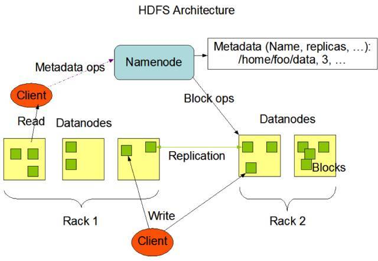
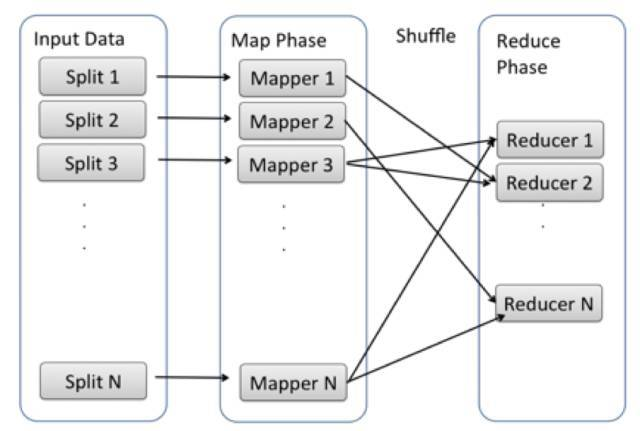
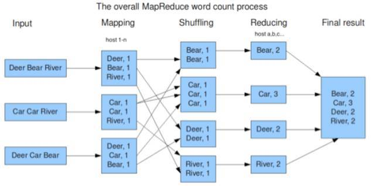
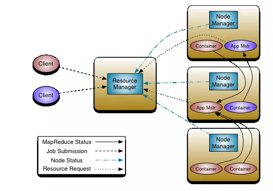

[TOC]

# Hadoop

Hadoop是Apache软件基金会旗下的一个开源分布式平台。Hadoop以分布式文件系统HDFS(Hadoop Distributed File System)和MapReduce为核心，为用户提供了系统底层细节透明的分布式基础架构。
Hadoop生态系统主要包括Hive，Hbase，Spark，Storm，Mahout，Flume，ZooKeeper，Pig，Sqoop，Shark，Phoenix，Tez，Ambari。

## 1. Hadoop基础 
Hadoop基础部分主要包含了HDFS、MapReduce和Yarn三大核心。

### 1.1 HDFS
一个HDFS集群是有一个NameNode和一定数目的DataNode组成。
- NameNode   
NameNode是一个中心服务器，负责管理文件系统的名字空间(namespace)以及客户端对文件的访问。
在 HDFS 里， Name node 保存了整个文件系统信息，包括文件和文件夹的结构。其实和 linux 上的真的很像， HDFS 也是把文件和文件夹表示为 inode, 每个 inode 有自己的所有者，权限，创建和修改时间等等。HDFS 可以存很大的文件，所以每个文件都被分成一些 data block，存在不同机器上, name node 就负责记录一个文件有哪些 data block，以及这些 data block 分别存放在哪些机器上。

- DataNode   
存储data block的机器叫做DataNodes，在读写过程中，DataNode负责直接把用户读取的block传给client，也负责直接接收用户写的文件。

HDFS整体架构图，


HDFS数据上传过程，
1) Client端发送一个添加文件到HDFS的请求给NameNode；
2) NameNode告诉Client端如何来分发数据块以及分发的位置；
3) Client端把数据分为块(block)，然后把这些块分发到DataNode中；
4) DataNode在NameNode的指导下复制这些块，数据备份。

#### 1.1.1 数据备份
- Rack
通常若干台机器垂直的组成一个Rack，类似一个书架，一个rack共享一个电源，一条网线和一个交换机。HDFS存储数据默认一份数据存储三份，通常在同一个rack上存储一份，然后在另外一个rack上存储另外两份，保证数据 有更高的安全性。

- 读写
	- 写
如果HDFS为每一个block存储三份，那client如何来写，是否同时像三个DataNode写，显然不是这样。当 client 写文件创建新 block 的时后，Name nodes 会为这个 block 创建一个整个 HDFS cluster 里独有的 block ID，并且决定哪些 DataNodes 来存储这个 block 的所有备份。这些被选择的 DataNodes 组成一个队列，client 向队列的第一个 Data node 写，那么第一个 DataNode 除了把数据存在自己的硬盘上以外，还要把数据传给队列里的下一个 DataNode，如此这般，直到最后一个 DataNode 接到数据完毕。
	- 读
同样的，当 HDFS client 读取一个文件时，它首先从 Name nodes 获得这个文件所有 blocks 和每个 block 的所有备份所在机器位置。当 client 开始读取 block 时，client 会选择从“最近”的一台机器读取备份（“最近”指的是网络延迟最短），如果第一个备份出现问题，比如网络突然中断，或者硬盘出故障，那 client 就从第二个备份读，以此类推。

> 在读写一个文件时，当我们从 NameNodes 得知应该向哪些 DataNodes 读写之后，我们就直接和 DataNode 打交道，不再通过 NameNodes.

### 1.2 MapReduce
MapReduce是一个快速、高效、简单用于编写并行处理大数据程序并应用在大集群上的编程框架，整体分为三个阶段，分别是Map，Shuffle和Reduce。
- Map阶段
每台机器处理本机的数据，产生运算结果

- Shuffle阶段
将Map阶段结果汇总（按照关键字组合，相同的key会被传送到同一个reducer中），这就是Shuffle阶段

- Reduce阶段
处理shuffle后的结果，产出最终的结算结果

下面是MapReduce模型架构，



#### 1.2.1 Shuffle优化

我们从这个例子的图中可以看出，每个 map function 会输出一组 key value pair, Shuffle 阶段需要从所有 map host 上把相同的 key 的 key value pair 组合在一起，组合后传给 reduce host, 作为输入进入 reduce function 里。
所有map function产生的key可能有成百上千，经过shuffle组合key工作后，依然是相同的数目，而负责reduce host可能只有几十个，几百个，那 Hadoop 的分配 key value pair 的策略是什么？
**Partitioner component**负责计算哪些 key 应当被放到同一个 reduce host里(比如key值的hash value)。

- Map端操作
Map function 的运行方式就是从 RecordReader 那边读出一个 input key value pair, 处理，然后把处理结果（通常也是 key value pair 形式）写到一个Hadoop maintained memory buffer 里，然后读取下一个 input key value pair。
Hadoop maintained memory buffer 里的 key value pair 按 key 值排序，并且按照 reduce partition 分到不同 partition 里（这就是 partitioner 被调用的时候）。一旦 memory buffer 满了，就会被 Hadoop 写到 file 里，这个过程叫 spill, 写出的 file 叫 spill file.

>注意，这些 spill file 存在 map 所在 host 的 local disk 上，而不是我们之前介绍过的 HDFS.

随着 Map 不断运行，有可能有多个 spill file 被制造出来。当 Map 结束时，这些 spill file 会被 merge 起来——不是 merge 成一个 file，而是按 reduce partition 分成多个。

- 在 Reduce 端的运作
由于 Map tasks 有可能在不同时间结束，所以 reduce tasks 没必要等所有 map tasks 都结束才开始。事实上，每个 reduce task 有一些 threads 专门负责从 map host copy map output（默认是5个，可以通过 $mapred.reduce.parallel.copies 参数设置）；考虑到网络的延迟问题，并行处理可以在一定程度上提高效率。

---
了解了 Hadoop 如何处理 shuffle 之后，如何通过配置一些 Hadoop Job 的参数调整 Hadoop shuffle performance：
- io.sort.mb 这个参数控制 map 端 memory buffer 大小，越大每次 map 要 spill 的 file 就越大，总 spill file 个数越少; 所以如果你的 Hadoop Job map output 很多，适当增加这个参数有助于 performance；
- io.sort.spill.percent 这个参数控制 map memory buffer 到达多少比例时开始 spill. 我们知道 spill 是写 IO 操作，所以需要时间。如果 percentage 太高，有可能当 spill 还没有完成时，map output 已经把 memory buffer 填满，这样影响 performance；同样，太低会造成太多 spill fie;
- tasktracker.http.threads 控制 map 端有多少个 thread 负责向 reduce 传送 map output. 本着并行计算的原则，可以适当调高;
- mapred.reduce.parallel.copies 这个参数控制 reduce 端有多少个 thread 去 copy map output. 本着并行计算的原则，可以适当调高;
- mapred.job.reduce.input.buffer.percent 控制 reduce host 上 JVM 中用于 merge map output 的比例。可以适当调高;
- io.sort.factor控制 reduce 端同时被 sort 的文件的个数。我们说 reduce 端 file sor t分批进行，这个参数就是每批有多少个。如果内存大，可以适当增加，以减少 sort 批次。

### 1.3 Yarn

#### 1.3.1 之前的Hadoop的Component架构
- JobTracker
JobTracker一个进程的形式运行，一直等待用户提交的任务，当JobTracker接收了用户的提取交的任务（指定mapper function/reducer function/data path）后，接下来挑选机器执行相应的函数。

- TaskTracker
上面提到了，需要JobTracker挑选机器来执行相应的函数，那么需要定义一下每台机器的繁忙程度，Hadoop所做的是为每一台机器定义N个slot，slot占用的个数来衡量机器的繁忙程度，slot是通过机器cpu和内存的情况设定的。JobTracker只是运行在一台机器上的一个进程，它是如何知道其它机器有哪些slot呢？
它是通过TaskTracker完成的，TaskerTracker是运行在每一台机器上的一个[daemon](https://baike.baidu.com/link?url=mID4rL3vgdW_nrMaposCBC-At_NdgqB_YuHyTWgr8XufNXXH49MrM4IIHvwanEEj41BPhn3WSDCDimd7Vh5mDEDRUAcCaeh_GP_qLqOwo2a)，它的首要任务就是跟踪本台机器有那些slot，当TaskTracker启动时，它从机器管理员写的config file中读取这台机器有几个slot，当JobTracker分配给这台机器一个mapper function或者reducer function时，那TaskTracker就会将slot个数减少一个。

- TaskTracker和Slots
TaskTracker 有一个 heartbeat 机制，就是每隔几秒钟或者几分钟向 JobTracker 发一个信息，告之当前机器还有几个 free slot. 这样，JobTracker 就知道所有 Hadoop 机器资源使用情况。那么下次 JobTracker 收到用户提交的任务时，就有足够的信息决定向哪个机器分配 mapper 或 reducer 任务。

#### 1.3.2 MRv2（YARN）
经典的MapReduce程序最严重的限制主要关系到可伸缩性、资源利用和对与MapReduce不同工作的负载支持。在MapReduce框架中，作业执行受两种类型的进程控制：一个称为JobTracker的主要进程，它负责协调在集群上运行的所有作业，分配要在TaskTracker上要运行mapper function或者reducer function任务；另外一个就是许多的TaskerTracker进程，他们负责运行分配的任务并定期向JobTracker报告进度。

基于之前存在缺点，YARN（也称为MRv2）诞生，它主要包括ResourceManager、ApplicationMaster、NodeManager，其中ResourceManager用来代替集群管理器，ApplicationMaster代替一个专用且短暂的JobTracker，NodeManager代替TaskTracker。
MRv2最核心的思想是将之前的JobTracker的两个主要功能分离为连个单独的组件，这两个功能是资源管理和任务调度/监控。资源管理器(ResourceManager)负责全局管理所有的应用程序计算资源的分配，每一个应用程序的ApplicationMaster负责相应的调度和监控。这里的应用程序指MapReduce任务或者DAG（有向无环图）任务。

yarn架构图如下，


将JobTracker和TaskTracker进行分离，它由下面几大构成组件：
a. 一个全局的资源管理器 ResourceManager
b.ResourceManager的每个节点代理 NodeManager
c. 表示每个应用的 ApplicationMaster
d. 每一个ApplicationMaster拥有多个Container在NodeManager上运行

- **ResourceManager(资源管理器，RM)**
RM有两个重要的组件：Scheduler和ApplicationsManager。
	- Scheduler
	负责分配资源给每个正在运行的应用（仅负责分配资源），资源的形态以container表示，后面介绍
    - ApplicationManager
    负责管理整个系统中所有应用程序，包括应用程序提交、与调度器协商资源以启动ApplicationMaster、监控ApplicationMaster运行状态并在失败时重新启动它等

- **ApplicationMaster(AM)**
用户提交的每一个应用程序均包含一个AM，主要功能：
	- 与RM调度器协商以获取资源（container）
	- 与NM通信以启动/停止任务
	- 监控所有任务的运行状态，并在任务失败时重新申请资源以重启任务

- **NodeManager(NM)**
NM是每个节点上的资源和任务管理器，一方面，它会定时地向RM汇报本节点上的资源使用情况和各个Container的运行状态；另一方面，它接收并处理来自AM的Container启动/停止等各种请求。

> Container是YARN中的资源抽象，它封装了某个节点上的多维度资源，如内存、CPU、磁盘、网络等，当AM向RM申请资源时，RM为AM返回的资源便是用Container表示。YARN会为每个任务分配一个Container，且该任务只能使用该Container中描述的资源。


## 2. Hadoop生态系统：Hive

用于Hdoop的一个数据仓库系统，它提供类似SQL的查询语言，通过使用该语言，可以方便对数据进行汇总，特定查询以及分析存放在Hadoop兼容文件系统中的大数据。

### 2.1 Hive表 

#### 2.1.1 分区
- 动态分区
```
set hive.exec.dynamic.partition=true;
set hive.exec.dynamic.partition.mode=nonstrict;
```
- 静态分区

> 两者的区别主要是插入数据时，静态分区需要指定分区的取值，而动态分区不需要指定，会自动根据列的取值进行分区（当分区级数多且数据量大时方便）

#### 2.1.2 分桶
```
set hive.enforce.bucketing=true;
set hive.enforce.sorting=true;
```
按照分桶字段的hash值去模除以分桶的个数，只能mapreduce中间结果insert到分桶表中（set mapreduce.job.reduces = num;）


> 分桶和分区的区别，参考[链接](https://blog.csdn.net/weixin_39393048/article/details/82530254)，分区是针对hdfs目录的操作（粗粒度），分桶是针对文件的操作（细粒度）

1、方便抽样
2、提高join查询效率(相同分桶表，桶数是倍数关系)

### 2.2 Hive查询操作优化

#### 2.2.1 join优化
```
hive.optimize.skewjoin=true;如果是join过程中出现倾斜 应该设置为true
set hive.skewjoin.key=100000; 这个是join的键对应的记录条数，超过这个值则会进行优化

hive.skewjoin.mapjoin.map.tasks 默认10000
hive.skewjoin.mapjoin.min.split 默认33554432
```

#### 2.2.2 group by
```
hive.group.skewindata=true; 如果是group by过程出现倾斜，应该设置为true
set hive.groupby.mapaggr.checkinterval=100000; 这个是group的键对应的记录条数超过这个值则会进行优化
```


#### 2.2.3 count distinct
```
select count(distinct id) from tablename;

after optimize

select count(1) from (select distinct id from tablename) tmp;
select count(1) from (select id from tablename group by id) tmp;
```

### 2.3 Hive job优化

1. 并行化执行
每个查询被Hive转化为多个阶段，有些阶段关联性不大，则可以并行化执行，减少执行时间

    ```
    set hive.exec.parallel=true;
    set hive.exec.parallel.thread.number=8;
    ```
2. job合并输入小文件
```
set hive.input.format=org.apache.hadoop.hive.ql.io.CombineHiveInputFormat
```
> 合并文件数由mapred.max.split.size限制的大小决定

3. job合并输出小文件

```
set hive.merge.smallfiles.avgsize=256000000;当输出文件平均大小小于该值，启动新job合并文件
set hive.merge.size.per.task=64000000;合并之后的文件大小

When the average output file size of a job is less than this number, Hive will start an additional map-reduce job to merge the output files into bigger files. This is only done for map-only jobs if hive.merge.mapfiles is true, and for map-reduce jobs if hive.merge.mapredfiles is true.
```

### 2.4 Hive Map优化

（1）如果想增加map个数，则设置mapred.map.tasks 为一个较大的值。
（2）如果想减小map个数，则设置mapred.min.split.size 为一个较大的值。
（3）如果输入中有很多小文件，依然想减少map个数，则需要将小文件merger为大文件，然后使用准则2。

参考[链接](https://www.jianshu.com/p/af5ff4c3348f)

### 2.5 Hive Shuffle优化
- Map端
```
io.sort.mb
io.sort.spill.percent
min.num.spill.for.combine
io.sort.factor
io.sort.record.percent
```

- Reduce端
```
mapred.reduce.parallel.copies
mapred.reduce.copy.backoff
io.sort.factor
mapred.job.shuffle.input.buffer.percent
mapred.job.reduce.input.buffer.percent
```


### 2.6 Hive Reduce优化
需要reduce操作的查询

- 聚合函数   
sum,count,distinct...

- 高级查询   
group by, join, distribute by, sort by, cluster by...
order by 比较特殊，只需要一个reduce(比较慢)
sort by 按照reducers来排序
distribute by 按照字段分发到reducer
参考[链接](https://blog.csdn.net/fantasticqiang/article/details/80769316)

```
mapred.reduce.tasks
the default number of reduce tasks per job, -1自动调整

hive.exec.reducers.max 默认999

hive.exec.reducers.bytes.per.reducer
每个reducer的字节，根据输入自动切分
```

以上主要参考[Hive之——Hive SQL优化](https://blog.csdn.net/l1028386804/article/details/80629279)

## 3. Hadoop生态系统：HBase
一种分布式的、可伸缩的、大数据存储库，支持随机、实时读/写访问。


## Reference
- [五分钟零基础搞懂Hadoop](https://zhuanlan.zhihu.com/p/20176725)
- [5分钟深入浅出 HDFS
](https://zhuanlan.zhihu.com/p/20267586)
- [五分钟深入 Hadoop 内核](https://zhuanlan.zhihu.com/p/20176737)
- [yarn(百度百科)](https://baike.baidu.com/link?url=pKvKqtKFCPVQ7o8P7872cj1unPEYeppXheM_rzon2HchYzWmMpLCByKtFKc9QqSbgd-sTVczzyvU_B-XlbtWk_)
- [5分钟 Hadoop Shuffle 优化](https://zhuanlan.zhihu.com/p/20261259)