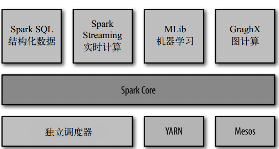

# Spark概述

[TOC]

## 1. spark 简介

spark是一个实现快速通用的集群计算平台。它是由加州大学伯克利分校AMP实验室 开发的通用内存并行计算框架，用来构建大型的、低延迟的数据分析应用程序。它扩展了广泛使用的MapReduce计算模型。高效的支撑更多计算模式，包括交互式查询和流处理。spark的一个主要特点是能够在内存中进行计算，及时依赖磁盘进行复杂的运算，spark比MapReduce更加高效。

### 1.1 spark组件

spark项目包含多个紧密集成的组件。spark的核心是一个对由很多计算任务组成的、运行在多个工作机器或者是一个计算集群上应用进行调度、分发以及监控的计算引擎。其主要组件如下图，

- Spark Core

  实现Spark的基本功能，包括任务调度、内存管理、错误恢复、与存储系统交互等，以及RDD（Resilient Distributed Dataset, 弹性分布式数据集）API的定义。

  > RDD表示分布在多个计算节点上可以并行操作的元素集合，是Spark的主要编程对象

- Spark SQL

  Spark SQL是Spark用来操作结构化数据的程序包。通过Spark SQL，我们可以使用SQL或者Hive（hql）来查询数据，Spark SQL支持多种数据源，比如hive 表、Parquet以及JSON等。

- Spark Streaming

  用来对实时数据进行流式计算的组件，Streaming中提供操作流式数据的API与RDD高度对应。Streaming与日志采集工具Flume、消息处理Kafka等可集成使用。 

- MLlib

  机器学习（ML）的功能库，提供多种学习算法，包括分类、回归、聚类、协同过滤等，还提供了模型评估、数据导入等功能。 

- GraphX

  用来操作图的程序库，可以用于并行的图计算。扩展了RDD API功能，用来创建一个顶点和边都包含任意属性的有向图。支持针对图的各种操作，如图的分割subgraph、操作所有的顶点mapVertices、三角计算等。 

- 集群管理器

  Spark支持在各种集群管理器（cluster manager）上运行，包括Hadoop的YARN、Apache的Mesos以及Spark自带的一个简易调度器，叫独立调度器。

> 上面提到的Spark Strenming和GraphX目前不熟悉

### 1.2 spark优势特点

## Refercences

- [Spark的各个组件](https://blog.csdn.net/ronggh/article/details/80168740)

- [Spark入门系列（一） | 30分钟理解Spark的基本原理](https://mp.weixin.qq.com/s?__biz=MzI0ODcxODk5OA==&mid=2247506529&idx=4&sn=45512adfecfa06871ae55681ceec7601&chksm=e99ee998dee9608e0f82b4d538b7f1661bbd2ee095af25294931a73fb70209f41a4dc7b1fd99&mpshare=1&scene=1&srcid=&sharer_sharetime=1564488073347&sharer_shareid=e53fc678b87c854a7577418ee1c671ac&pass_ticket=JCvEQkAg%2FtdwGW8rEoDDIQ45DTOVa26jUe8%2F%2FHOnZ2TE7Mix17PKXZKJaeccJ8OO#rd)

