# Spark概述

[TOC]

## 1. spark 简介

spark是一个实现快速通用的集群计算平台。它是由加州大学伯克利分校AMP实验室 开发的通用内存并行计算框架，用来构建大型的、低延迟的数据分析应用程序。它扩展了广泛使用的MapReduce计算模型。高效的支撑更多计算模式，包括交互式查询和流处理。spark的一个主要特点是能够在内存中进行计算，及时依赖磁盘进行复杂的运算，spark比MapReduce更加高效。


### 1.1 spark组件

spark项目包含多个紧密集成的组件。spark的核心是一个对由很多计算任务组成的、运行在多个工作机器或者是一个计算集群上应用进行调度、分发以及监控的计算引擎。其主要组件如下图，


- Spark Core

  实现Spark的基本功能，包括任务调度、内存管理、错误恢复、与存储系统交互等，以及RDD（Resilient Distributed Dataset, 弹性分布式数据集）API的定义。

  > RDD表示分布在多个计算节点上可以并行操作的元素集合，是Spark的主要编程对象

- Spark SQL

  Spark SQL是Spark用来操作结构化数据的程序包。通过Spark SQL，我们可以使用SQL或者Hive（hql）来查询数据，Spark SQL支持多种数据源，比如hive 表、Parquet以及JSON等。

- Spark Streaming

  用来对实时数据进行流式计算的组件，Streaming中提供操作流式数据的API与RDD高度对应。Streaming与日志采集工具Flume、消息处理Kafka等可集成使用。 

- MLlib

  机器学习（ML）的功能库，提供多种学习算法，包括分类、回归、聚类、协同过滤等，还提供了模型评估、数据导入等功能。 

- GraphX

  用来操作图的程序库，可以用于并行的图计算。扩展了RDD API功能，用来创建一个顶点和边都包含任意属性的有向图。支持针对图的各种操作，如图的分割subgraph、操作所有的顶点mapVertices、三角计算等。 

- 集群管理器

  Spark支持在各种集群管理器（cluster manager）上运行，包括Hadoop的YARN、Apache的Mesos以及Spark自带的一个简易调度器，叫独立调度器。

> 上面提到的Spark Strenming和GraphX目前不熟悉

### 1.2 spark优势特点

- 高效性

  不同于MapReduce将中间计算结果放入磁盘中，Spark采用内存存储中间计算结果，减少了迭代运算的磁盘IO，并通过并行计算DAG图的优化，减少了不同任务之间的依赖，降低了延迟等待时间。内存计算下，Spark 比 MapReduce 快100倍。

- 易用性

  不同于MapReduce仅支持Map和Reduce两种编程算子，Spark提供了超过80种不同的Transformation和Action算子，如map,reduce,filter,groupByKey,sortByKey,foreach等，并且采用函数式编程风格，实现相同的功能需要的代码量极大缩小。

  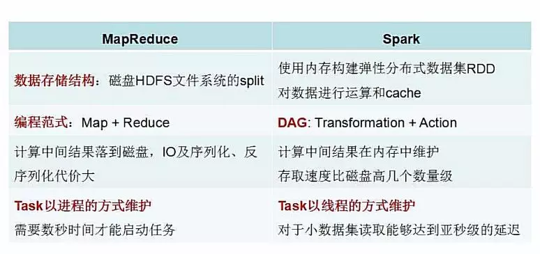

- 通用性

  Spark提供了统一的解决方案。Spark可以用于批处理、交互式查询（Spark SQL）、实时流处理（Spark Streaming）、机器学习（Spark MLlib）和图计算（GraphX）。

  这些不同类型的处理都可以在同一个应用中无缝使用。这对于企业应用来说，就可使用一个平台来进行不同的工程实现，减少了人力开发和平台部署成本。

  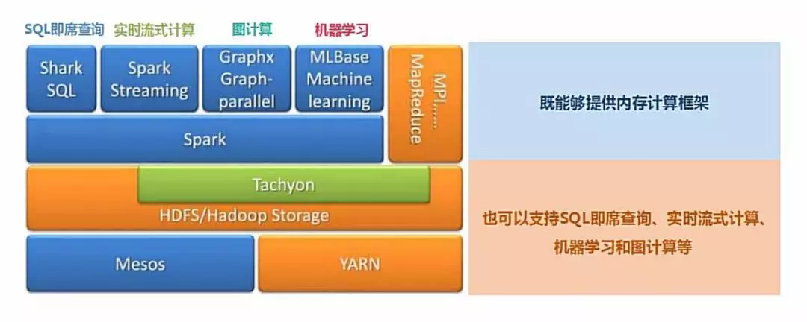

- 

- 兼容性

  Spark能够跟很多开源工程兼容使用。如Spark可以使用Hadoop的YARN和Apache Mesos作为它的资源管理和调度器，并且Spark可以读取多种数据源，如HDFS、HBase、MySQL等。

  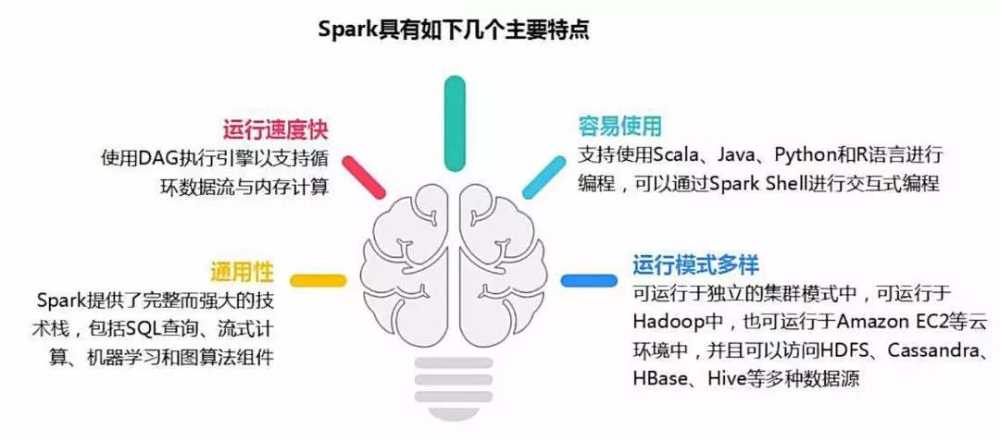


## 2. Spark框架

### 2.1 Spark基本概念

- RDD(Resilient Distributed Dataset)

  RDD，弹性分布式数据集， 是分布式内存的一个抽象概念，RDD提供了一种高度受限的共享内存模型，即RDD是只读的记录分区的集合，只能通过在其他RDD执行确定的转换操作（如map、join和group by）而创建，然而这些限制使得实现容错的开销很低。对开发者而言，RDD可以看作是Spark的一个对象，它本身运行于内存中，如读文件是一个RDD，对文件计算是一个RDD，结果集也是一个RDD ，不同的分片、 数据之间的依赖 、key-value类型的map数据都可以看做RDD。

- DAG(Directed Acyclic Graph)

  DAG，有向无环图，反应RDD之间的依赖关系。

---

以下为spark架构设计相关概念，

- Driver Program

  控制程序，负责为Application构建DAG图。

- Cluster Manager

  集群资源管理中心，负责分配计算资源。

- Worker Node

  工作节点，负责完成具体计算。

- Executor

  是运行在工作节点（Worker Node）上的一个进程，负责运行Task，并为应用程序存储数据。

---

以下为任务相关的概念，

- Application

  用户编写的Spark应用程序，一个Application包含多个Job。

- Job

  作业，一个Job包含多个RDD及作用于相应RDD上的各种操作。，一个Job包含多个Stage

- Stage

  阶段，是作业的基本调度单位，一个作业会分为多组任务，每组任务被称为“阶段”，一个Stage包含多个Task。

- Task

  任务，运行在Executor上的工作单元，是Executor中的一个线程。

任务相关的概念可以下图概括，

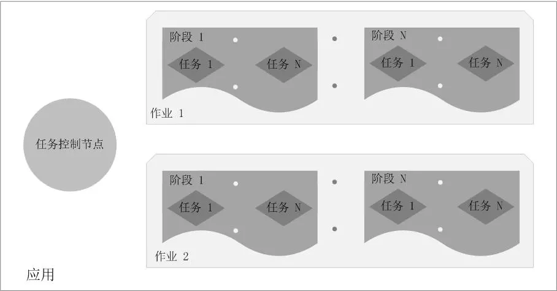

> **总结：Application由多个Job组成，Job由多个Stage组成，Stage由多个Task组成。Stage是作业调度的基本单位。**

### 2.2 Spark架构设计

Spark集群由Driver, Cluster Manager（Standalone,Yarn 或 Mesos），以及Worker Node组成。对于每个Spark应用程序，Worker Node上存在一个Executor进程，Executor进程中包括多个Task线程。

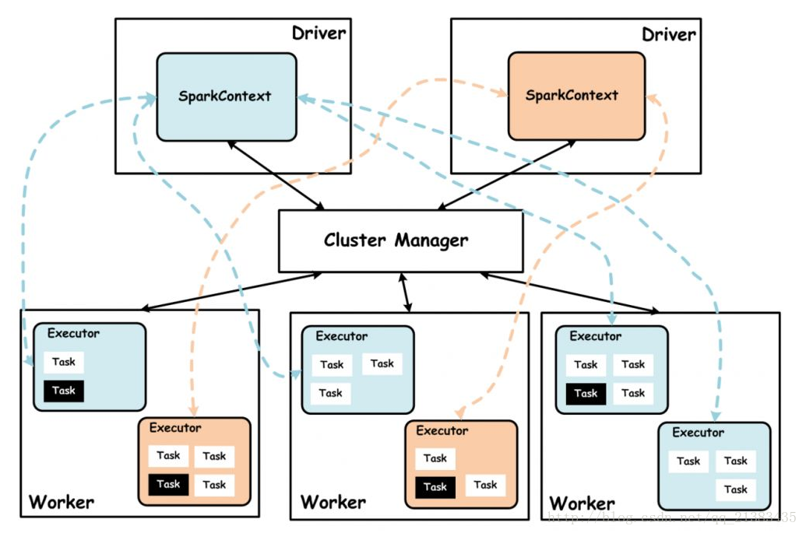

### 2.3 Spark运行流程

1. Application首先被Driver构建DAG图并分解成Stage。

2. 然后Driver向Cluster Manager申请资源。

3. Cluster Manager向某些Work Node发送征召信号。

4. 被征召的Work Node启动Executor进程响应征召，并向Driver申请任务。

5. Driver分配Task给Work Node。

6. Executor以Stage为单位执行Task，期间Driver进行监控。

7. Driver收到Executor任务完成的信号后向Cluster Manager发送注销信号。

8. Cluster Manager向Work Node发送释放资源信号。

9. Work Node对应Executor停止运行。

整个过程如下所示，

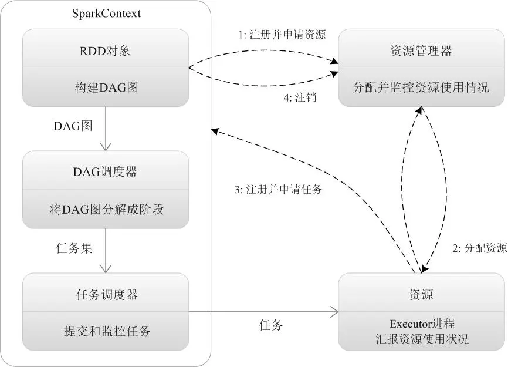

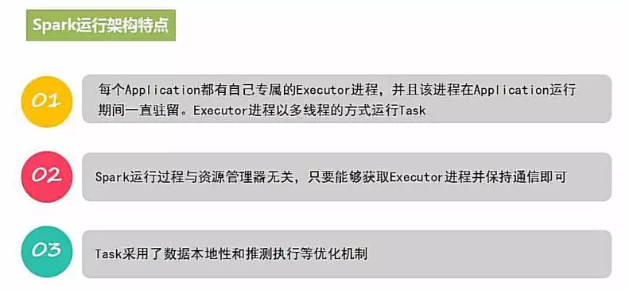

### 2.4 Spark部署模式

- Local

  本地运行模式，非分布式

- Standalone

  使用Spark自带集群管理器，部署后只能执行Spark任务

- Yarn

  Hadoop集群管理器，部署后可以同时运行MapReduce，Spark，Storm，Hbase等各种任务。

  > 有关Yarn的相关资源管理框架参考`../hadoop/hadoop.md`中介绍

- Mesos

  与Yarn最大的不同是Mesos 的资源分配是二次的，Mesos负责分配一次，计算框架可以选择接受或者拒绝。

> 多数使用Yarn资源管理器，可以同时运行MR和Spark程序

### 2.5 RDD数据的操作

RDD是弹性分布式数据集，是Spark的基本数据结构，它代表一个**不可变**、**可分区**、其中元素可以并行计算的集合。一般有两种方式创建RDD，

- 读取文件中的数据生成RDD
- 将内存中的对象**并行化**后生成RDD

在RDD创建完成后，即可以使用各种操作对RDD进行编程，RDD操作有两种类型，Transformation和Action。

- Transformation

  从一个已经存在的RDD创建一个新的RDD

- Action

  从一个已经存在的RDD上进行计算，并将计算结果返回到Driver端

> Transformation操作具有Lazy特性，即Spark不会立刻进行实际的计算，只会记录执行的轨迹，只有触发Action操作的时候，它才会根据DAG图真正的执行。

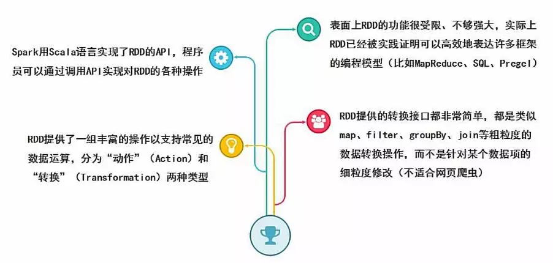

上面提到了RDD的操作有两种关系（Transformation和Action），RDD之间的依赖关系也有两种，即**宽依赖**和**窄依赖**。

- 窄依赖

  父RDD的分区和子RDD的分区关系是一对一或者多对一的关系

- 宽依赖

  父RDD的分区和子RDD的分区是一对多或者多对多的关系

> 宽依赖关系操作一般具有shuffle的过程，即通过一个partitioner函数将父RDD中每个分区上key不同的记录分发到不同的子RDD分区

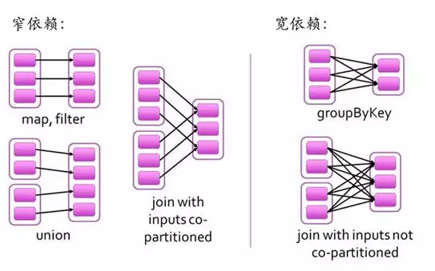

在**2.1 Spark 基本概念**中提到了任务相关的概念，而RDD的依赖关系确定了Stage的切分方式。

- **切割规则**(从后往前，遇到宽依赖就切割Stage)

  RDD之间的依赖关系形成一个DAG有向无环图，DAG会提交给DAGScheduler，DAGScheduler会把DAG划分成相互依赖的多个Stage，划分Stage的依据就是RDD之间的宽窄依赖。遇到宽依赖就划分Stage,每个Stage包含一个或多个task任务。然后将这些task以taskSet的形式提交给TaskScheduler运行。

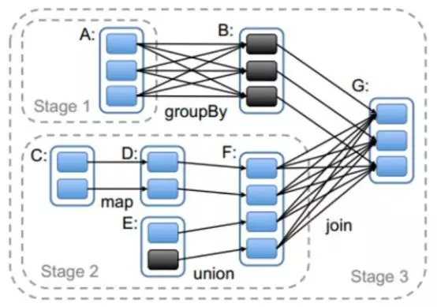

#### 2.5.1 word count示例

```scala
# scala code
val file = sc.textFile("hello.txt")
val word = file.flatMap(_.split(","))
val wordOne = word.map((_,1))
wordOne.reduceByKey(_+_)
```

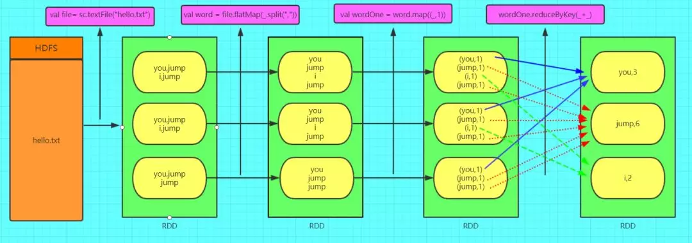

### 2.5 RDD编程

本部分主要介绍RDD相关的code操作，包括RDD的创建、相应的Trasnformation和Action的操作。

> 主要以pyspark作为示例


## Refercences

- [Spark的各个组件](https://blog.csdn.net/ronggh/article/details/80168740)

- [Spark入门系列（一） | 30分钟理解Spark的基本原理](https://mp.weixin.qq.com/s?__biz=MzI0ODcxODk5OA==&mid=2247506529&idx=4&sn=45512adfecfa06871ae55681ceec7601&chksm=e99ee998dee9608e0f82b4d538b7f1661bbd2ee095af25294931a73fb70209f41a4dc7b1fd99&mpshare=1&scene=1&srcid=&sharer_sharetime=1564488073347&sharer_shareid=e53fc678b87c854a7577418ee1c671ac&pass_ticket=JCvEQkAg%2FtdwGW8rEoDDIQ45DTOVa26jUe8%2F%2FHOnZ2TE7Mix17PKXZKJaeccJ8OO#rd)

- [RDD](https://baike.baidu.com/item/RDD/5840158)

- [Spark的driver理解和executor理解](https://blog.csdn.net/zpf336/article/details/83006569)