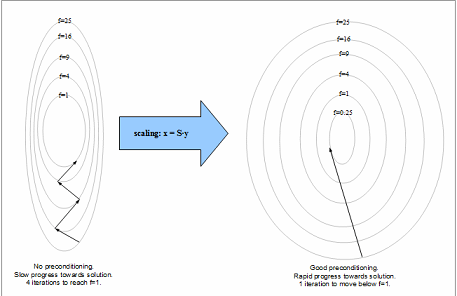
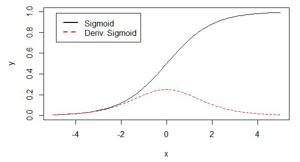

## 1. 如何设置网络初始值
一般总是使用服从（截断）高斯或均匀分布的随机值，具体是高斯还是均匀分布影响不大，但是也没有详细的研究。

但是，初始值的大小会对优化结果和网络的泛化能力产生较大的影响。

一些启发式初始化策略通常是根据输入与输出的单元数来决定初始权重的大小，比如 Glorot and Bengio (2010) 中建议使用的标准初始化，其中 m 为输入数，n 为输出数
$$
W_{i,j} \sim U(-\sqrt{\frac{6}{m+n}}, \sqrt{\frac{6}{m+n}})
$$

还有一些方法推荐使用随机正交矩阵来初始化权重 (Saxe et al., 2013)。

## 2. 为什么推荐使用高斯分布？
当我们由于缺乏关于某个实数上分布的先验知识而不知道该选择怎样的形式时，正态分布是默认的比较好的选择，其中有两个原因：
   1. 我们想要建模的很多分布的真实情况是比较接近正态分布的。**中心极限定理（central limit theorem）**说明很多独立随机变量的和近似服从正态分布。这意味着在实际中，很多复杂系统都可以被成功地建模成正态分布的噪声，即使系统可以被分解成一些更结构化的部分。
   2. 在具有相同方差的所有可能的概率分布中，正态分布在实数上具有最大的不确定性。因此，我们可以认为**正态分布是对模型加入的先验知识量最少的分布**。

正态分布有单边量和多变量形式， 
- 单变量  
对于单边量$x \in R$，高斯分布的参数为均值$\mu \in R$和方差$\sigma^2>0$，其概率密度函数
$$
p(x|u,\sigma^2) = \frac{1}{\sqrt{2\pi \sigma^2}}exp\left\{-\frac{(x-\mu)^2}{2\sigma^2}\right\}
$$
其均值和方差分别为$\mu$和$\sigma^2$   
- 多变量   
对于$d$维向量$\boldsymbol{x}$，多元高斯分布的参数为$d$维向量$\boldsymbol{\mu}$和$d \times d$的对称正定协方差矩阵$\boldsymbol{\Sigma}$，概率密度函数 
$$
p(\boldsymbol{x}|\boldsymbol{\mu}, \boldsymbol{\Sigma}) = \frac{1}{\sqrt{(2\pi)^d det(\boldsymbol{\Sigma})}}exp\left\{-\frac{1}{2}(\boldsymbol{x}-\boldsymbol{\mu})^T\boldsymbol{\Sigma}^{-1}(\boldsymbol{x}-\boldsymbol{\mu})\right\}
$$

## 3. 如何避免深度学习中的病态，鞍点，梯度爆炸，梯度弥散？

### 3.1 病态  
简单来说，深度学习中的病态问题指的就是学习/优化变的困难，需要更多的迭代次数才能达到相同的精度。    
更具体的，导致病态的原因是问题的条件数（condition number）非常大，其中**条件数 = 函数梯度最大变化速度 / 梯度最小变化速度**（对于二阶可导函数，条件数的严格定义是：**Hessian矩阵最大特征值的上界 / 最小特征值的下界**）。    
条件数大意味着目标函数在有的地方（或有的方向）变化很快、有的地方很慢，比较不规律，从而很难用当前的局部信息（梯度）去比较准确地预测最优点所在的位置，只能一步步缓慢的逼近最优点，从而优化时需要更多的迭代次数

#### 3.1.1 如何避免病态

知道了什么是病态，那么所有有利于加速训练的方法都属于在避免病态，其中最主要的还是优化算法。

深度学习主要使用的优化算法是梯度下降，所以避免病态问题的关键是改进梯度下降算法：

- 随机梯度下降（SGD）、批量随机梯度下降   
- 动态的学习率   
- 带动量的 SGD   

网络的病态问题通常与训练数据、网络结构以及网络的初始化权重有关。常见的问题是输入训练数据过大、网络层结构大小不一、初始权重过大或过小。所以在网络训练之前需要进行precondition。   
数学上，precondition是将病态问题转化为更容易优化求解的问题，通常通过乘以一个preconditioner 矩阵来完成转化。如下图所示，转化前需要4次迭代收敛到f=1,转化后仅需一次迭代。 

### 3.2 鞍点
对于很多高维非凸函数（神经网络）而言，局部极小值/极大值事实上都远少于另一类梯度为零的点：鞍点

- 鞍点定义   
神经网络优化问题中的鞍点即一个维度向上倾斜且另一维度向下倾斜的点，或者说**在一个方向是极大值，另一个方向是极小值的点**。   
该点处的梯度为0,该点出的Hessian矩阵是不定的（特征值有正有负）。  

#### 3.2.1 如何避免鞍点
优化算法上使用自适应学习率的优化算法（AdaDelta, Adam等）

### 3.3 梯度爆炸&消失  
梯度消失与梯度爆炸其实是一种情况，两种情况下梯度消失经常出现，一是在深层网络中，二是采用了不合适的激活函数，比如sigmoid。梯度爆炸一般出现在深层网络和权值初始化值太大的情况下。

#### 3.3.1 梯度爆炸&消失的原因  
以一个四层的全连接网络为例，假设每一层的输出为$f_i(x)$，其中$i$表示第$i$层的输入，也就是$i-1$层的输出，$f$是激活函数，那么有$f_{i+1}=f(f_i*w_{i+1}+b_{i+1})$，简单记为$f_{i+1}=f(f_i*w_{i+1})$。   
其中权重的更近基于BP算法，$w \leftarrow w+\Delta w$，给定学习率$\alpha$，得出$\Delta w=-\alpha \frac{\partial Loss}{\partial w}$，以更新第二个隐含层的权值为例，根据链式求导法则，有$\Delta w_2=\frac{\partial Loss}{\partial w}=\frac{\partial Loss}{\partial f_4} \frac{\partial f_4}{\partial f_3} \frac{\partial f_3}{\partial f_2} \frac{\partial f_2}{\partial w_2}$，其中$\frac{\partial f_4}{\partial f_3}$就是对激活函数进行求偏导，如果此不分大于1,那么层数增多的时候，最终求得的梯度将以指数的形式增加，即**梯度爆炸**，如果此部分小于1,随着层数的增加，求出的梯度信息将会以指数的形式衰减，即**梯度消失**。   

**从深层网络角度来讲，不同的层学习的速度差异很大，表现为网络中靠近输出的层学习的情况很好，靠近输入的层学习的很慢，有时甚至训练了很久，前几层的权值和刚开始随机初始化的值差不多。**因此，梯度消失、爆炸，其根本原因在于反向传播训练法则，属于先天不足，另外多说一句，Hinton提出capsule的原因就是为了彻底抛弃反向传播，如果真能大范围普及，那将是一个巨大的变革。

#### 3.3.2 sigmoid激活函数   
以sigmoid函数为激活函数为例，在反向传播更新参数时，需要对激活函数求导，sigmoid函数求导后为$deri(\sigma(z))=\sigma(z)(1-\sigma(z))$，其函数图像和原图像如下，  
 
从上图sigmoid函数取值趋于饱和时，其导数越来越接近于0，越来越小，很容易发生梯度消失。

#### 3.3.3 避免梯度消失&爆炸
现实中，往往梯度消失出现的更多。   

- 梯度剪切   
该方式主要是针对梯度爆炸提出的，设置一个剪切阈值，如果梯度超过这个阈值，就将其限制在这个范围内   
- 网中添加正则项
  - 损失中加L2   
  可以让整体参数偏小，以防止梯度爆炸。  
  - BN(Batch Normalization)    
  将整体权重放缩到均值为零方差为1的标准正态分布，具体可以参考**算法篇/deep_learning/深度学习基础**
  
- 激活函数   
relu函数的导数在正数部分是恒等于1的，可以解决梯度消失和爆炸的问题且加速了网络的训练   

- 网络结构   
目前很多网络结构的设计在一定程度上可以避免梯度爆炸和消失。比如ResNet和LSTM

### 3.4 参考资源  
- [神经网络激活函数sigmoid relu tanh 为什么sigmoid 容易梯度消失](https://blog.csdn.net/danyhgc/article/details/73850546)   
- [详解机器学习中的梯度消失、爆炸原因及其解决方法](https://blog.csdn.net/qq_25737169/article/details/78847691)

## 4. 在深度神经网络中，引入了隐藏层（非线性单元），放弃了训练问题的凸性，其意义何在？

放弃训练问题的凸性，简单来说，就是放弃寻求问题的最优解。

非线性单元的加入，使训练问题不再是一个凸优化问题。这意味着神经网络很难得到最优解，即使一个只有两层和三个节点的简单神经网络，其训练优化问题仍然是 NP-hard 问题 (Blum & Rivest, 1993).

但即使如此，使用神经网络也是利大于弊的：

- 人类设计者只需要寻找正确的**函数族**即可，而不需要去寻找精确的函数。
- 使用简单的梯度下降优化方法就可以高效地找到足够好的局部最小值
- 增强了模型的学习/拟合能力，如原书中所说“ maxout 单元可以以任意精度近似任何凸函数”。至于放弃凸性后的优化问题可以在结合工程实践来不断改进。 “似乎传统的优化理论结果是残酷的，但我们可以通过**工程方法**和**数学技巧**来尽量规避这些问题，例如启发式方法、增加更多的机器和使用新的硬件（如GPU）。

## 5. 为什么交叉熵损失相比均方误差损失能提高以 sigmoid 和 softmax 作为激活函数的层的性能？

简单来说，就是使用均方误差（MSE）作为损失函数时，会导致大部分情况下**梯度偏小**，其结果就是权重的更新很慢，且容易造成“梯度消失”现象。而交叉熵损失克服了这个缺点，当误差大的时候，权重更新就快，当误差小的时候，权重的更新才慢。

## 6. 为什么 L1 和 L2 正则化可以防止过拟合？

L1 & L2 正则化会使模型偏好于更小的权值。

简单来说，更小的权值意味着更低的模型复杂度，也就是对训练数据的拟合刚刚好（奥卡姆剃刀），不会过分拟合训练数据（比如异常点，噪声），以提高模型的泛化能力。

此外，添加正则化相当于为模型添加了某种先验（限制），规定了参数的分布，从而降低了模型的复杂度。模型的复杂度降低，意味着模型对于噪声与异常点的抗干扰性的能力增强，从而提高模型的泛化能力。

## 7. 信息熵、KL 散度（相对熵）与交叉熵

## 8. 如何避免数值计算中的上溢和下溢问题，以 softmax 为例

## 9. 为什么LSTM要优于RNN？

- LSTM可以避免RNN中出现的梯度消失(gradient vanishing)，但是不能解决梯度爆炸（解决方式参考上面的问题）

  > 了解[为什么相比于RNN，LSTM在梯度消失上表现更好？](https://www.zhihu.com/question/44895610)

- 记住的信息长度更长

## 10. 深度网络中出现过overfit往往怎么解决？

- drop out
- regularization
-  batch normalization

## 11. Jacobian，Hessian矩阵及其在深度学习中的重要性 

