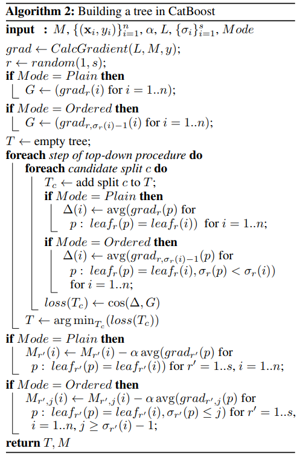

[TOC]

# CatBoost

CatBoost，类似XGBoost和LightGBM算法，是boosting算法框架一种，算法主要有两大特色，

- 处理类别类型特征
- ordered boosting(修正gradient bias)

下面第一部分和第二部分分别介绍这两大特色。

## 1. Categorical features

### 1.1 类别变量转换为连续值

对类别变量的核心处理是将其类别替换为连续的值。

假设数据为$D=\{(\boldsymbol{X}_i,Y_i)\}_{i=1,\ldots,n},\ \boldsymbol{X}_i=(x_{i,1},\ldots, x_{i,m}) \in R^m, Y_i \in R$，即数据有$n$个样本，$m$个特征（包括连续变量和类别变量），$Y_i$是第$i$个样本的标签。

假设第$k$个特征为类别变量，一种简单的处理方式是将类别替换为对应标签的均值，表达如下
$$
x_{i,k}=\frac{\sum_{j=1}^n[x_{j,k}=x_{i,k}]\cdot Y_j}{\sum_{j=1}^n[x_{j,k}=x_{i,k}]}
$$
这种方式有一个较大的缺陷是容易发生标签泄露，比如某个类别只有一个样本，显然此时取值变为标签的取值。

为了避免上面的情况，catboost采用了一种方法是将所有样本随机打乱，然后依次**以累计的方式**（ordered TS, target statistic）用上面的公式计算，假设这个随机打乱为$\sigma = (\sigma_1,\ldots,\sigma_n)$，则
$$
x_{\sigma_p,k}=\frac{\sum_{j=1}^{p-1}[x_{\sigma_p,k}=x_{i,k}]\cdot Y_j + a \cdot P}{\sum_{j=1}^n[x_{\sigma_p,k}=x_{i,k}] + a}
$$
其中$P$和$a$是一个自定义的值，用来平滑低频次的类别。另外上面所提及的累计的方式主要体现在$x_{\sigma_p,k}$只与前$p-1$个样本有关。

上面处理是一种处理方式，一般来说替换规则是按照处理的任务进行区分，

- 回归任务

  通常时计算标签的均值来替换

- 分类任务

  通常用正样本的比例来替换

注意到，如果只用一个随机打乱的话，显然存在较大的偏差，所以在每一步迭代时，均将样本进行打乱。

### 1.2 特征组合

Catboost除了将类别特征转换为连续值外，还考虑了特征之间的组合（类别和类别变量间的组合和类别和连续值的组合），要穷举所有类别变量的组合显然不切实际，catboost采用了一种贪婪的方式来做，

在树的根节点创建时，未考虑特征组合，在之后的分割中考虑当前树中的数据集所有特征的特征组合，将这些特征组合值按照上面的方式转换为连续型的数值。

对于类别型变量和连续型变量也做了特征的组合：连续型特征会找到一个最优切割点，此时可以将连续变量看做一个具有两个类别的类别变量，然后再考虑和类别变量进行特征组合。

## 2. Fighting Gradient Bias

在类似gbdt算法框架中，每一步（每棵树）均来学习当前样本的梯度，这些梯度值在每一步均是由相同的样本通过当前的模型估计而得到，这种方式会导致梯度值分布发生偏移（有相关的论文做了分析，具体为什么发生偏移我不知道）。下面大致叙述一下如何改变这种情况，

大多数GBDT算法中，整体来看需要两个步骤，分别为**决策树的建立**和**设置叶子的得分**。

- 决策树的建立

  通常就是需要遍历所有的特征，以及特征所对应的的候选点集合，然后找到最优的特征分割点，递归进行增长

- 设置叶子的得分

  leaf value往往通过**梯度或者Newton step进行估计**

在fighting gradient bias中，主要对第一种方式进行了改进。

catboost有两种boosting模式，分别为`ordered`和`plain`

- `oredered`

  对样本随机打乱，对$n$个样本学习$n$个模型$M_1,\ldots,M_n$，其中$M_i$的模型通过前$i-1$个样本学习得到，这种学习模式和前面提到的类别特征处理方式是一致的。这种方式是对梯度偏移一种有效的解决方法，由于需要学习$n$个模型，这也极大增加了复杂度和内存的消耗。

  

  > 其中打乱方式和类别变量使用的打算方式是一致的，否则会导致预测偏移

- `plain`

  标准的GBDT算法

其中决策创建过程如下，

首先第一行为输入，包括当前已学习的模型$M$，全量样本$\{(\boldsymbol{x_i},y_i)\}$，学习率$\alpha$，损失函数$L$，$s$个全量样本随机打乱，$Mode$，`oredered`或者`plain`

计算当前的的梯度$grad$，然后从$s$个打乱中随机选择一个记为$r$。

如果$Mode$为$Plain$则根据打乱顺序重新排列一下梯度即可，如果$Mode$为$Ordered$则只用前$i-1$个梯度值。

下面为建树过程，

首先初始化一颗空树，**按照分割点来计算所有样本的的平均梯度，依次作为梯度值，然后计算该梯度值和上面求得的梯度值的夹角余弦，用此值来衡量该分割点的增益程度**。然后遍历所有可能的分割点选择最优特征分割点来生长树，迭代该过程即可。

从上图中可以看出，叶子中的预测值为叶子里面样本的平均梯度。

## 3. 总结

总体来看，CatBoost有两方面改进，一个是可以增加类别变量的处理（ordered TS），另外一个是通过ordered boosting方式来修正梯度值的偏移。从论文中实验结果（分类任务）来看，其相比较于LightGBM和XGBoost两个算法，提升是比较大的。

## 4. 算法实现

在CatBoost的[官方文档](https://catboost.ai/docs/)中，整体算法实现以及介绍是非常详细的。

### 4.1 算法细节

在其官方文档中，有专门讲解算法细节部分，大致回顾一下，

- Building stages for a single tree

  1. [Preliminary calculation of splits](https://catboost.ai/docs/concepts/algorithm-main-stages_pre-count.html#algorithm-main-stages_pre-count).

     对于连续变量通过Quantization的方式将其离散化为多个buckets，然后得到候选分割点（quantizatioin的方式和buckets的个数可以自己设置）

  2. (*Optional*) [Transforming categorical features to numerical features](https://catboost.ai/docs/concepts/algorithm-main-stages_cat-to-numberic.html#algorithm-main-stages_cat-to-numberic)

     Before each split is selected in the tree, categorical features are transformed to numerical. This is done using various statistics on **combinations of categorical features** and **combinations of categorical and numerical features**.

     官方提供的转换方式还是挺多的（计算规则类似于第一部分），而且也支持one-hot的方式。

  3. [Choosing the tree structure](https://catboost.ai/docs/concepts/algorithm-main-stages_choose-tree-structure.html#algorithm-main-stages_choose-tree-structure). This stage is affected by the set [Bootstrap options](https://catboost.ai/docs/concepts/algorithm-main-stages_bootstrap-options.html).

     1. A list is formed of possible candidates (“feature-split pairs”) to be assigned to a leaf as the split.
     2. A number of penalty functions are calculated for each object (on the condition that all of the candidates obtained from step 1 have been assigned to the leaf).
     3. The split with the smallest penalty is selected.

  4. Calculating values in leaves.

To prevent overfitting, use the [overfitting detector](https://catboost.ai/docs/concepts/overfitting-detector.html). When it is triggered, trees stop being built.

