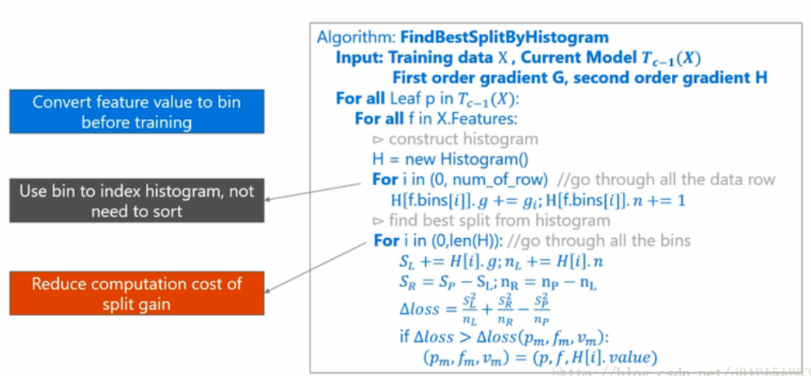
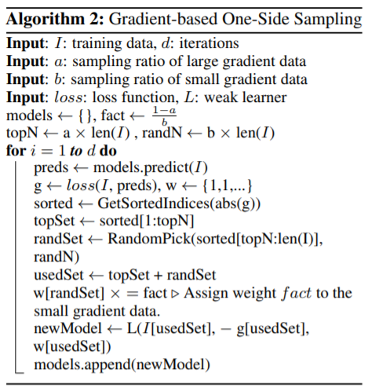
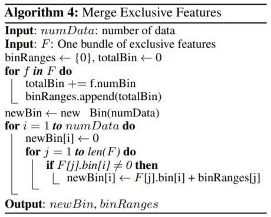

[TOC]

# LightGBM

尽管XGBoost和其它的一些boosting算法已经实现较高的训练精度，但是当数据量极大时（样本量和特征量均特别大），这些算法计算速度会明显下降，主要原因是需要处理所有样本和所有的特征，显然这比较耗时。

为了解决这两大难题，LightGBM应运而生，它主要提出两种解决方法，Gradient-based One-Side Sampling(GOSS)和Exclusive Feature Bundling(EFB)。

- Gradient-based One-Side Sampling

  这种方式着重**减少样本量**，通过剔除部分小梯度的样本，即只用大梯度的样本来估计信息增益。

- Exclusive Feature Bundling

  这种方式着重**减少特征数量**，将取值互斥的特征进行合并（很少情况下他们同时取非零值）

## 1.决策树生长策略

### 1.1 分割点的增益

像CART树采用基尼系数（分类）和均方误差（回归），XGBoost中的衡量方式为
$$
L_{split}=\frac{1}2 \left[ \frac{(\sum_{i \in I_L}g_i)^2}{\sum_{i \in I_L}h_i + \lambda} + \frac{(\sum_{i \in I_R}g_i)^2}{\sum_{i \in I_R}h_i + \lambda} - \frac{(\sum_{i \in I}g_i)^2}{\sum_{i \in I}h_i + \lambda} \right] - \gamma
$$
Lightgbm中采用方式为
$$
L_{split}=\frac{(\sum_{i \in I_L}g_i)^2}{|\sum_{i \in I_L}|} + \frac{(\sum_{i \in I_R}g_i)^2}{|\sum_{i \in I_R}|} - \frac{(\sum_{i \in I}g_i)^2}{|\sum_{i \in I} |}
$$
其中$|\sum_{i \in I_L}|$表示左节点样本量，$|\sum_{i \in I_R}|$表示右节点样本量，$|\sum_{i \in I}|$表示未分割前节点样本量

显然有$|\sum_{i \in I_L}|+|\sum_{i \in I_R}|=|\sum_{i \in I}|$。

### 1.2 分割点的选择

多数boosting tree算法分割点的选择都需要将特征进行预排序，然后采用不同的遍历策略来选择最优分割点，显然这种操作比较耗时且消耗内存。lightgbm算法使用histogram-based algorithm进行分割点的选择，其不需要对数据进行排序，而是将特征取值离散化为多个bins，然后只需要遍历bins即可获得特征的分割点。

Lightgbm算法整体改进（EFB和GOSS）均是基于Histogram-based algorithm，如下是算法框架，

第一层for循环遍历当前树种所有叶子节点

第二层for循环遍历所有的特征，为每一个特征建立一个直方图，直方图中主要存储了两类信息，一是bin中样本的梯度之和，而是bin中样本的数量。

第三层for循环则是遍历所有的样本，将样本划分至不同的bin中，同时累计相应的梯度和样本数量。

第四层for循环则是遍历所有的bin，分别以当前的bin作为分割点，然后计算loss的下降程度（或者说增益程度），最终选取最大的增益，以此时的特征和bin的特征值作为分裂节点的特征和分裂特征取值。

## 2. Gradient-based One-Side Sampling

该算法的主要目的是想在不改变数据分布且不损失太多模型精度的前提下，减少训练样本的数量。

针对当前已经训练好的模型，每个样本的梯度有着重要意义，梯度越大表明该样本under-trained，基于这种想法，GOSS采用的策略是将样本按照梯度值由大到小进行排序，选择前百分之$a$的样本，然后从剩余的样本中随机选择百分之$b$的样本（这部分样本梯度值乘以$\frac{1-a}{b}$进行放缩），**这种策略可以保证在不改变样本分布的前提下，减少样本数量且更关注那些under-trained样本**。

算法框架如下，

> 原论文对于GOSS有理论的证明

## 3. Exclusive Feature Bundling

这种方式主要目的是降低特征的数量。

当许多特征的取值很少同时取非零值时，说明这些特征比较稀疏，完全可以将其合并，称这个合并体为`exclusive feature bundle`，**在做分割点的选择时，和单个特征类似，完全可以为一个feature bundle建立一个直方图，然后寻找最佳分割点。**

该算法需要实现两个功能，一个是确定需要bundle的特征，其次是确定如何进行特征的bundle。

- 确定特征的bundle集合

  对于第一个问题，这是一个NP-hard问题。我们把feature看作是图中的点（V），feature之间的总冲突看作是图中的边（E）。而寻找寻找合并特征且使得合并的bundles个数最小，这是一个[图着色问题](https://zh.wikipedia.org/wiki/图着色问题)，
  所以这个**找出合并的特征且使得bundles个数最小**的问题需要使用近似的贪心算法来完成。
  算法框架如下，

  

首先定义$K$,允许最大的冲突的数量（特征之间最大的不同时为非零的数量），然后初始化图（以特征为顶点，以特征之间的冲突数量作为权重），以图中的度由大致小的顺序进行排序，然后遍历图（遍历特征），确定该特征应该添加到哪一个bundle中，一旦确定，立刻跳出循环，开始下一轮遍历，最终将所有的特征分为多个bundle set，接下来需要确定如何合并bundle。

- 合并bundle

  因为直方图算法存储的离散的bins值，而不是特征的具体取值，所以在合并bundle时可以令互斥的特征在不同的bins中，对于存在特征取值交叉的，可以为特征添加一个偏移项，然后合并bundle。

  算法框架如下，

  

第一层for循环中，遍历bundle set中特征，累加所有特征中的Bin个数并保留每一次的累加值。

第二程for循环中，遍历所有的样本，为每个样本生成一个新的bin值。

第三层for循环中，遍历bundle set中的特征，将第$j$个特征的bin值加上第$j$特征的累计值（确保不同特征之间不会出现bin值交叉），以此作为新的bin值。

> 原论文中设置参数$\gamma$来控制特征之间发生冲突的比例，设置为0时，表示不允许有冲突的发生。

## 4. 总结

LightGBM算法使用直方图算法来寻找最优分割点，算法包含两种新颖的方式，Gradient-based One-Side Sampling和Exclusive Feature Bundling，分别来处理大样本量和大量特征，从理论和实验上均得到了验证。

从实验结果可以看出，LightGBM在运算速度和内存消耗上要极大的优于XGBoost，这主要得益于GOSS和EFB两种算法。

- GOSS

  通过GOSS算法来对样本进行采样，很大程度上加速了计算速度，但仍然需对全量数据进行计算，比如模型预测和梯度的计算，所以计算速度提升有限。

- EFB

  EFB算法通过对特征进行合并减少了特征数量，可以看到对于大量稀疏特征的情况下，EFB算法极大的提升了运算速度。

## 4. 算法实现

LightGBM的[官方文档](https://lightgbm.readthedocs.io/en/latest/)目前提供了Python和C的API，其对LightGBM的主要特点（除了GOSS和EFB）做了总结。

### 4.1 Features

- **Optimization in Speed and Memory Usage**

  采用直方图算法找分割点，不需要要特征预排序，可以看出直方图算法有如下优点，

  - **Reduced cost of calculating the gain for each split**

    O(#data)降低值O(#bins)

  - **Use histogram subtraction for further speedup**

    利用直方图做差减少不必要的计算 ，只需要计算父节点和某一个字节点信息即可。

  - **Reduce memory usage**

    对每一个特征只需要存储其直方图相关信息（#bins）即可，不需要存储全量信息。

  - **Reduce communication cost for parallel learning**

    因为存储信息少，所以并行学习时可以降低交互的延迟。

- **Sparse Optimization**

  只需要O(2*#non_zero_data)来构建稀疏特征的直方图。

- **Optimization in Accuracy**

  lightgbm算法采用Leaf-wise策略进行树的生长，在树生长时，从所有叶子中选择loss下降程度最大的叶子来生长（往往来说leaf-wise策略比level-wise策略获取更小的损失），当数据较小时leaf-wise策略容易导致过拟合，此时需要通过参数`max_depth`来控制树的生长。

  下面是两种决策树生长策略示意图，

  
  
  

- **Optimal Split for Categorical Features**

  对于类别变量传统的做法是做one-hot encoding，对于特征类别数量多（high-cardinality）的情况下，这种方式容易导致不均衡且需要树生长较深来实现一个好的精度。

  Instead of one-hot encoding, the optimal solution is to split on a categorical feature by partitioning its categories into 2 subsets. If the feature has k categories, there are 2^(k-1) - 1 possible partitions. But there is an efficient solution for regression trees[8]. It needs about O(k * log(k)) to find the optimal partition.

  The basic idea is to sort the categories according to the training objective at each split. More specifically, LightGBM sorts the histogram (for a categorical feature) according to its accumulated values (`sum_gradient` / `sum_hessian`) and then finds the best split on the sorted histogram.

- **Optimization in Parallel Learning**

  - 特征并行 

    **特征并行主要是指并行找到最优的分割点**

    - 传统算法

      1. 将数据垂直分区（按列进行分区，不同的worker拥有不同的特征集合）
      2. 每个worker根据自己的特征集合找到局部最优的特征分割点（特征，特征分割点）
      3. 每个worker之间相互通信，找出全局最优的特征分割点。
      4. 按照最优特征分割点进行分割，将分割后的数据再分发到不同的worker中。
      5. 其余worker按照接收到的数据执行分割（更新数据）

      主要缺点是多个worker不停地进行通信

    - LightGBM

      在每个worker上均备份全量数据。

      1. 每个worker根据自己的特征集合找到局部最优的特征分割点（特征，特征分割点）
      2. 每个worker之间相互通信，找出全局最优的特征分割点。
      3. 然后每个worker执行分割即可，不需要额外的通信

  - 数据并行

    数据并行主要体现在决策树的学习上。

    - 传统算法

      1. 将数据水平分区 （按行进行分区，不同的worker拥有不同的行集合）
      2. 每个worker根据自己的数据集构建局部的直方图
      3. 每个worker之间通信将局部直方图汇总为全局的直方图
      4. 然后根据全局的直方图找到最优分割点

      主要缺点和特征并行类似，worker之间的通信

    - LightGBM

      1. Instead of “Merge global histograms from all local histograms”, LightGBM uses “Reduce Scatter” to merge histograms of different (non-overlapping) features for different workers. Then workers find the local best split on local merged histograms and sync up the global best split.
      2. As aforementioned, LightGBM uses histogram subtraction to speed up training. Based on this, we can communicate histograms only for one leaf, and get its neighbor’s histograms by subtraction as well.

  

### 4.2 参数调整

- For Faster Speed
  - Use bagging by setting `bagging_fraction` and `bagging_freq`
  - Use feature sub-sampling by setting `feature_fraction`
  - Use small `max_bin`
  - Use `save_binary` to speed up data loading in future learning
- For Better Accuracy
  - Use large `max_bin` (may be slower)
  - Use small `learning_rate` with large num_iterations
  - Use large `num_leaves` (may cause over-fitting)
  - Use bigger training data
  - Try `dart`

- Deal with Over-fitting
  - Use small `max_bin`
  - Use small `num_leaves`
  - Use `min_data_in_leaf` and `min_sum_hessian_in_leaf`
  - Use bagging by set `bagging_fraction` and `bagging_freq`
  - Use feature sub-sampling by set `feature_fraction`
  - Use bigger training data
  - Try `lambda_l1`, l`ambda_l2` and `min_gain_to_split` for regularization
  - Try `max_depth` to avoid growing deep tree

