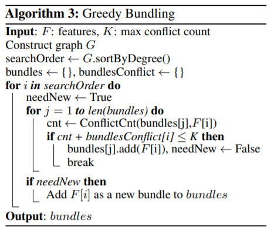

[TOC]

# LightGBM

尽管XGBoost和其它的一些boosting算法已经实现较高的训练精度，但是当数据量极大时（样本量和特征量均特别大），这些算法计算速度会明显下降，主要原因是需要处理所有样本和所有的特征，显然这比较耗时。

为了解决这两大难题，LightGBM应运而生，它主要提出两种解决方法，Gradient-based One-Side Sampling(GOSS)和Exclusive Feature Bundling(EFB)。

- Gradient-based One-Side Sampling

  这种方式着重**减少样本量**，通过剔除部分小梯度的样本，即只用大梯度的样本来估计信息增益。

- Exclusive Feature Bundling

  这种方式着重**减少特征数量**，将取值互斥的特征进行合并（很少情况下他们同时取非零值）

## 1.决策树生长策略

### 1.1 分割点的增益

像CART树采用基尼系数（分类）和均方误差（回归），XGBoost中的衡量方式为
$$
L_{split}=\frac{1}2 \left[ \frac{(\sum_{i \in I_L}g_i)^2}{\sum_{i \in I_L}h_i + \lambda} + \frac{(\sum_{i \in I_R}g_i)^2}{\sum_{i \in I_R}h_i + \lambda} - \frac{(\sum_{i \in I}g_i)^2}{\sum_{i \in I}h_i + \lambda} \right] - \gamma
$$
Lightgbm中采用方式为
$$
L_{split}=\frac{(\sum_{i \in I_L}g_i)^2}{|\sum_{i \in I_L}|} + \frac{(\sum_{i \in I_R}g_i)^2}{|\sum_{i \in I_R}|} - \frac{(\sum_{i \in I}g_i)^2}{|\sum_{i \in I} |}
$$
其中$|\sum_{i \in I_L}|$表示左节点样本量，$|\sum_{i \in I_R}|$表示右节点样本量，$|\sum_{i \in I}|$表示未分割前节点样本量

显然有$|\sum_{i \in I_L}|+|\sum_{i \in I_R}|=|\sum_{i \in I}|$。

### 1.2 分割点的选择

多数boosting tree算法分割点的选择都需要将特征进行预排序，然后采用不同的遍历策略来选择最优分割点，显然这种操作比较耗时且消耗内存。lightgbm算法使用histogram-based algorithm进行分割点的选择，其不需要对数据进行排序，而是将特征取值离散化为多个bins，然后只需要遍历bins即可获得特征的分割点。

Lightgbm算法整体改进（EFB和GOSS）均是基于Histogram-based algorithm，如下是算法框架，

第一层for循环遍历当前树种所有叶子节点

第二层for循环遍历所有的特征，为每一个特征建立一个直方图，直方图中主要存储了两类信息，一是bin中样本的梯度之和，而是bin中样本的数量。

第三层for循环则是遍历所有的样本，将样本划分至不同的bin中，同时累计相应的梯度和样本数量。

第四层for循环则是遍历所有的bin，分别以当前的bin作为分割点，然后计算loss的下降程度（或者说增益程度），最终选取最大的增益，以此时的特征和bin的特征值作为分裂节点的特征和分裂特征取值。

## 2. Gradient-based One-Side Sampling

该算法的主要目的是想在不改变数据分布且不损失太多模型精度的前提下，减少训练样本的数量。

针对当前已经训练好的模型，每个样本的梯度有着重要意义，梯度越大表明该样本under-trained，基于这种想法，GOSS采用的策略是将样本按照梯度值由大到小进行排序，选择前百分之$a$的样本，然后从剩余的样本中随机选择百分之$b$的样本（这部分样本梯度值乘以$\frac{1-a}{b}$进行放缩），**这种策略可以保证在不改变样本分布的前提下，减少样本数量且更关注那些under-trained样本**。

算法框架如下，

> 原论文对于GOSS有理论的证明

## 3.  Exclusive Feature Bundling

这种方式主要目的是降低特征的数量。

当许多特征的取值很少同时取非零值时，说明这些特征比较稀疏，完全可以将其合并，称这个合并体为`exclusive feature bundle`，**在做分割点的选择时，和单个特征类似，完全可以为一个feature bundle建立一个直方图，然后寻找最佳分割点。**

该算法需要实现两个功能，一个是确定需要bundle的特征，其次是确定如何进行特征的bundle。

- 确定需要的bundle

  对于第一个问题，这是一个NP-hard问题。我们把feature看作是图中的点（V），feature之间的总冲突看作是图中的边（E）。而寻找寻找合并特征且使得合并的bundles个数最小，这是一个[图着色问题](https://zh.wikipedia.org/wiki/图着色问题)，
  所以这个**找出合并的特征且使得bundles个数最小**的问题需要使用近似的贪心算法来完成。
  算法框架如下，

  

首先定义$K$,允许最大的冲突的数量（特征之间最大的不同时为非零的数量），然后初始化图（以特征为顶点，以特征之间的冲突数量作为权重），以图中的度由大致小的顺序进行排序，然后遍历图（遍历特征），确定该特征应该添加到哪一个bundle中，一旦确定，立刻跳出循环，开始下一轮遍历，最终将所有的特征分为多个bundle set，接下来需要确定如何合并bundle。

- 合并bundle

  因为直方图算法存储的离散的bins值，而不是特征的具体取值，所以在合并bundle时可以令互斥的特征在不同的bins中，对于存在特征取值交叉的，可以为特征添加一个偏移项，然后合并bundle。

  算法框架如下，

  

第一层for循环中，遍历bundle set中特征，累加所有特征中的Bin个数并保留每一次的累加值。

第二程for循环中，遍历所有的样本，为每个样本生成一个新的bin值。

第三层for循环中，遍历bundle set中的特征，将第$j$个特征的bin值加上第$j$特征的累计值（确保不同特征之间不会出现bin值交叉），以此作为新的bin值。

## 4. 算法实现

