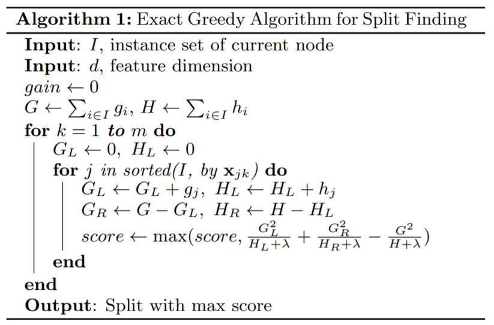
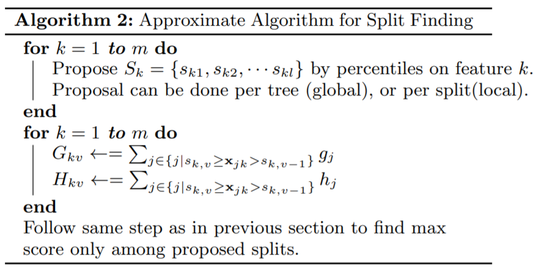
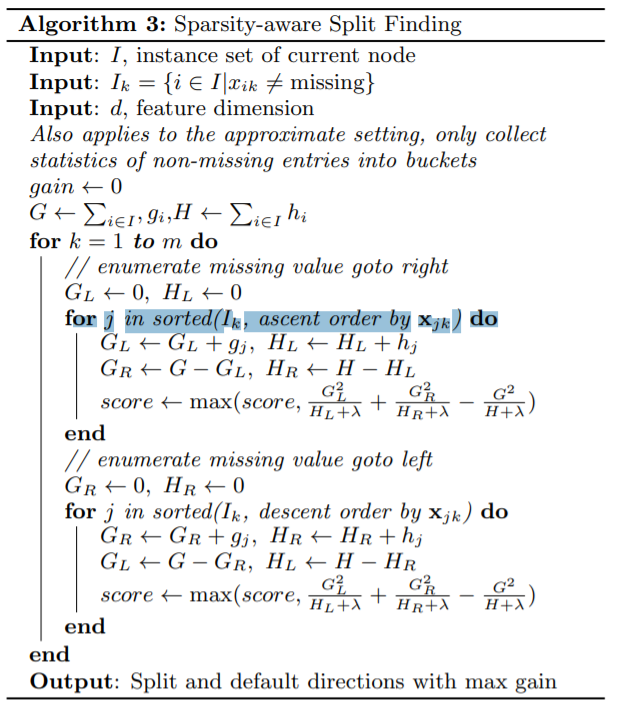

[TOC]

# XGBoost

xgboost，类似GBDT算法，是boosting算法框架的一种。

## 1. Algorithm Frameworks

假设数据有$n$个样本，每个样本有$m$个特征，将其表示为$D=\{(\boldsymbol{x}_i,y_i)\}, |D|=n, \boldsymbol{x}_i \in R^m, y_i \in R$

### 1.1 基于决策树的boosting框架表示

基于boosting框架，对于样本$\boldsymbol{x}_i$，最终的预测值可以表示为
$$
\hat{y_i}=\phi(\boldsymbol{x_i})=\sum_{k=1}^Kf_k(\boldsymbol{x_i})
$$
其中，$K$表示基学习器的个数，$f_k(\cdot)$表示第$k$个基学习器，这里$f_k(\cdot)$表示决策树模型。

对于一个创建好的决策树模型来说，任意一个样本，均可以映射到决策树中的某一个叶子中，然后取该叶子的得分表示这个样本的预测值，可用数学式表示为
$$
f(\boldsymbol{x})=w_{q(\boldsymbol{x})}
$$
其中$w$表示叶子上的得分，有$w \in R^T$，$T$是叶子的数量，而$q(\boldsymbol{x})$表示样本$\boldsymbol{x}$所对应的叶子index，可以理解$q$是一个映射，$q: R^m \rightarrow T, q(\boldsymbol{x}) \in [1, 2, \cdots, T]$。

### 1.2 目标学习函数的泰勒展开

基于上面的表示，我们可以定义一般的目标函数，
$$
objective = \sum_{i}l(\hat{y_i},y_{i})+\sum_k\Omega(f_k)
$$
其中$l$是凸可微的损失函数，$\hat{y_i}$为预测值，$\Omega$代表正则项，$f_k$是决策树模型，$\Omega(f)=\gamma T+\frac{1}{2}\lambda ||w||^2$。

对于上式中的目标函数无法直接根据优化算法直接求解$k$个决策树模型，往往通过**可加**的方式来求解，表示为如下，
$$
L^{(t)}=\sum_{i=1}^{n}l(y_i, \hat{y_i}^{(t-1)}+f_t(\boldsymbol{x}_i))+\Omega(f_t)
$$
其中$\hat{y_i}^{(t-1)}$表示第$i$个样本在$t-1$轮时的预测值（相当于是已知），而$f_t(\boldsymbol{x_i})$表示第$t$轮的决策树模型对样本$\boldsymbol{x_i}$的预测值（相当于未知，需要学习的模型）。

> 模型整体需要学习$K$个决策树模型，学习策略相当于是一个一个的进行学习。

接下来，对$f_t(\boldsymbol{x_i})$进行二阶泰勒展开，如下，
$$
L^{(t)} \approx \sum_{i=1}^n[l(y_i, \hat{y}^{(t-1)}) + g_if_t(\boldsymbol{x_i}) + \frac{1}{2}h_if_t^2(\boldsymbol{x_i})]+\Omega(f_t)
$$
其中$g_i=\frac{\partial l(y_i, \hat{y}^{(t-1)})}{\partial \hat{y}^{(t-1)}}$,$h_i=\frac{\partial^2 l(y_i, \hat{y}^{(t-1)})}{\partial^2 \hat{y}^{(t-1)}}$，分别为一阶和二阶偏导数。

> 个人理解相当于$f_t(\boldsymbol{x_i})=0$出进行展开

上式中，$l(y_i, \hat{y}^{(t-1)})$相当于为常数项，可去掉不讨论，然后$\Omega(f)=\gamma T+\frac{1}{2}\lambda ||w||^2$，带入上式中有，
$$
\begin{equation}\begin{split} 
\tilde{L}^{(t)}&=\sum_{i=1}^n[g_if_t(\boldsymbol{x_i}) + \frac{1}{2}h_if_t^2(\boldsymbol{x_i})]+\gamma T+\frac{1}{2}\lambda w^2 \\
&=\sum_{j=1}^T[(\sum_{i\in I_j}g_i)\cdot w_j + \frac{1}{2}(\sum_{i \in I_j} h_i + \lambda) \cdot w_j^2]+\lambda T
\end{split}\end{equation}
$$
其中$I_j$表示第$j$个叶子，$\sum_{i\in I_j}g_i$表示第$j$个叶子上所有样本的一阶梯度之和， $w_j$表示第$j$个叶子上的权重值（或者预测值）。

对于一个学习好的决策树模型来说，上式可以看做是关于$w_j$的一元二次函数，显然可以求得$w_j$的最优取值，
$$
w_j^*=-\frac{\sum_{i \in I_j}g_i}{\sum_{i \in I_j}h_i + \lambda}
$$
然后将$w_j^*$带入上式，有
$$
\tilde{L}^{(t)}=-\frac{1}2 \sum_{j=1}^T \frac{(\sum_{i \in I_j}g_i)^2}{\sum_{i \in I_j}h_i + \lambda} + \gamma T
$$
此时$\tilde{L}^{(t)}$可以表示为决策树的评分（由目标函数推导至此，显然可以作为评分），进一步可以利用此式作为决策树**分割点评选的标准**（切分后loss的下降程度），
$$
L_{split}=\frac{1}2 \left[ \frac{(\sum_{i \in I_L}g_i)^2}{\sum_{i \in I_L}h_i + \lambda} + \frac{(\sum_{i \in I_R}g_i)^2}{\sum_{i \in I_R}h_i + \lambda} - \frac{(\sum_{i \in I}g_i)^2}{\sum_{i \in I}h_i + \lambda} \right] - \gamma
$$
其中，$I_L$代表切分后左子节点的样本，$I_R$代表切分后右子节点的样本，$I$代表且分前节点的样本，显然有$I=I_L \cup I_R$

> 此处是和GBDT截然不同的，GBDT建树时相当于利用CART树的增益（基尼增益，mse等）来选择特征，而XGBoos则通过损失函数的二阶泰勒展开来求得叶子得分的解析解，从而得到建树时所用的增益指标。

## 2. Split Finding Algorithm 

在论文中提及了三种分割点寻找算法，分别是Basic Exact Greedy Algorithm、 Approximate Algorithm和Weighted Quantile Sketch。

### 2.1 Basic Exact Greedy Algorithm

遍历所有的特征对应的所有候选点，然后找到$L_{split}$值，这种方式称之为*exact greedy algorithm*。这种方式在GBDT以及决策树算法中也是最常见的。这种方式需要遍历所有的候选点，当样本量较大时显然这种方式比较耗时，为了加速计算，往往选择的一个策略就是对特征进行预排序，这样可以方便计算$L_{split}$中累计的一阶和二阶梯度值，如下所示，

### 2.2 Approximate Algorithm

不同于上面穷举所有的候选分割点，近似算法根据**特征的百分位**来列举候选点，然后从中选择最优的分割点，这样可以极大减少候选点遍历的个数。算法框架如下，

> 上面算法有两种变种，一种是初始时对特征提取百分位候选点（**global**，仅初始化一次候选点即可），另一种每次分割均根据当前叶子样本重新定义特征的百分位候选点（**local**，每次分割都需要初始化候选点），论文中对比了两种方式效果，当候选点个数（定义百分位少）偏少时，local的方式要优于global方式，当候选点个数较多时，两种方式接近。

### 2.3 Weighted Quantile Sketch

上面提出近似算法中，提出的候选点分布比较均匀，下面提出算法相当于对每个样本进行了加权。

第$k$个特征值及样本对应的二阶导数值定义为$D_k=\{(x_{1k}, h_1), (x_{2k}, h_2), \cdots, (x_{nk},h_n)\}$，定义排序函数$r_k： R \rightarrow [0, +\infty)$，
$$
r_k(z)=\frac{1}{\sum_{(x,h)\in D_k}h} \sum_{(x,h)\in D_k, x<z}h
$$
上式可以理解为第$k$个特征中，取值小于$z$的这部分样本占所有样本的权重。

所以可以定义候选点为$\{ s_{k1},s_{k2}, \cdots, s_{kl}\}$，这些分割点之间满足
$$
|r_k(s_{k,j}) - r_k(s_{k,j+1})|<\epsilon,\ s_{k1}=\min_i{\boldsymbol{x}_{ik}}, s_{kl}=\max_i{\boldsymbol{x}_{ik}}
$$
上式可以理解为两个候选点之间所对应的的样本权重应该小于$\epsilon$，直观理解这种定义方式大约有$\frac{1}{\epsilon}$个候选点。

> 其中上面的$h_i$可以看做是每个样本的权重，而近似算法中，可以看做是每个样本均为1

### 2.4. Sparsity-aware Split Finding

在该算法中，着重强调了缺失值的处理方式，对于存在缺失的特征，并没有填充或者删除，而是为其添加了一**个默认方向（决策树，左或者右）**，可以理解为在处理该特征时，将该特征的所有缺失样本添加到左节点计算增益，然后添加至右节点然后再计算增益，然后选择增益大的作为该缺失样本的方向。算法框架如下，

## 3.  Sytstem Design

### 3.1 Column Block for Parallel Learning

数据存储于`block`（内存单元）中，在`block`中，数据以压缩的格式存储，并且每个特征均根据相应的特征值进行了排序。相当于在训练前以此方式存储好数据，仅计算一次，后面可以重复利用该存储结果。

这种存储方式对模型的训练中诸多过程均有帮助，如exact greedy algorithm和 approximate algorithms，一阶二阶导数值的累计计算还有样本采样等。

- exact greedy algorithm

  之前的方式的算法复杂度相当于$O(Kd||x||_0\log n)$，其中$||x||_0$表示非缺失元素的个数，采用预存储的方式后，复杂度为$O(Kd||x||_0+||x||_0\log n)$。

- approximate algorithms

  之前的算法复杂度为$O(Kd||x||_0\log q)$,其中$q$为候选点的个数，采用预存储的方式后，复杂度为$O(Kd||x||_0+||x||_0\log B)$,其中$B$为`block`中最大的样本数量。

> 大致知道有此方面优化，具体的实现未研究

### 3.2 Cache-aware Access

虽然上面的设计有很大提升，但是数据量巨大时以至于无法放在内存中或者发生cash miss时，均会减缓最优分割点的找寻，以下为对应的优化方案。

- exact greedy algorithm

  设计了一个cache-aware prefetching algorithm，具体做法如下
  
  > Specifically, we allocate an internal buffer in each thread, fetch the gradient statistics into it, and then perform accumulation in a mini-batch manner. This prefetching changes the direct read/write dependency to a longer dependency and helps to reduce the runtime overhead when number of rows in the is large
  
  当数据量较大时，这种方式会有显著的提速。

- approximate algorithms

  主要是定义一个合适的block size（每个block存储的最大行数），具体做法如下

  >  We define the block size to be maximum number of examples in contained in a block, as this
  > reflects the cache storage cost of gradient statistics. 
  
  最终大致确定block size为$2^{16}$

### 3.3 Blocks for Out-of-core Computation

当数据量巨大而内存较小时，此时有必要利用磁盘空间，一旦涉及到磁盘空间，数据的读取，也即增加磁盘的IO是最重要的一件事情。其主要做了两方面的优化，

- Block Compression

  存储数据时按列进行压缩

  > The block is compressed by columns, and decompressed on the fly by an independent thread when loading into main memory.

- Block Sharding

  将数据存储于多个磁盘中

  > The second technique is to shard the data onto multiple disks in an alternative manner. A pre-fetcher thread is assigned to each disk and fetches the data into an in-memory buffer.

>  具体实现未研究，大致知道有此方面

## 4. XGBoost Implementation

目前XGBoost的[官方文档](https://xgboost.readthedocs.io/en/latest/)仍在持续更新，整理这篇文章时XGBoost的官文最新版本为0.9.0，记得最早使用XGBoost的时候版本为0.6.0。

XGBoost有很多语言版本，比如python，java，scala，Julia、R，Spark，Flink以及CLI方式。

官方文档中也有[XGBoost原理](https://xgboost.readthedocs.io/en/latest/tutorials/model.html)的详细介绍，注意到里面涉及到损失函数一个概念，提及logistic regression的损失函数为如下，
$$
L(\theta) = \sum_i[ y_i\ln (1+e^{-\hat{y}_i}) + (1-y_i)\ln (1+e^{\hat{y}_i})]
$$
相当于去掉sigmoid函数变换前的值，这个作为预测值$\hat{y_i}$，这个之前没有注意到，这种方式相当于统一了逻辑回归和XGBoost损失函数，当然逻辑回归损失进一步走下去的话，就是讲$\hat{y_i}$的表达式带入进入。