# Transformer

[TOC]

## 1. 模型简介

自从Attention机制在提出之后，加入Attention的Seq2Seq模型在各个任务上都有了提升，所以现在的seq2seq模型指的都是结合rnn和attention的模型。传统的基于RNN的Seq2Seq模型难以处理长序列的句子，无法实现并行，并且面临对齐的问题。

所以之后这类模型的发展大多数从三个方面入手：

- input的方向性：单向 -> 双向

- 深度：单层 -> 多层

- 类型：RNN -> LSTM GRU

但是依旧受到一些潜在问题的制约，神经网络需要能够将源语句的所有必要信息压缩成固定长度的向量。这可能使得神经网络难以应付长时间的句子，特别是那些比训练语料库中的句子更长的句子；每个时间步的输出需要依赖于前面时间步的输出，这使得模型没有办法并行，效率低；仍然面临对齐问题。

再然后CNN由计算机视觉也被引入到deep NLP中，CNN不能直接用于处理变长的序列样本但可以实现并行计算。完全基于CNN的Seq2Seq模型虽然可以并行实现，但非常占内存，很多的trick，大数据量上参数调整并不容易。

本篇文章创新点在于**抛弃了之前传统的encoder-decoder模型必须结合cnn或者rnn的固有模式，只用Attention**。文章的主要目的在于减少计算量和提高并行效率的同时不损害最终的实验结果。

> 为什么self attention可以替换rnn取得不错的效果？
>
> 为什么采用了multi-head attention而不用全连接（全连接也可以解决长距离依赖）？

## 2. 模型结构

模型框架图如下，

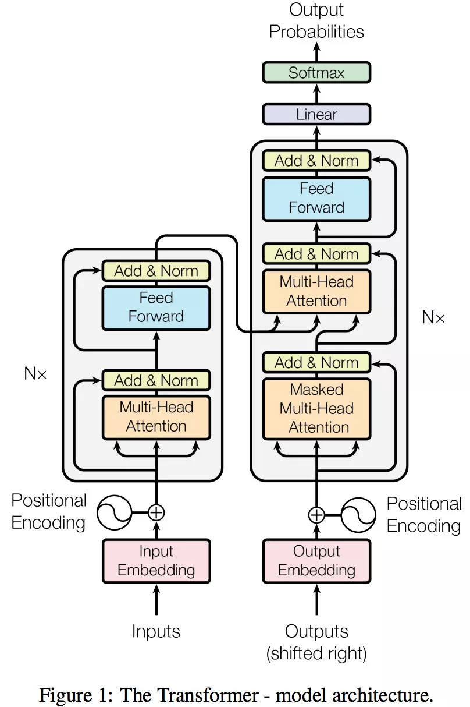

看上去构造还是比较复杂的，先从大面进行理解，然后一步步细化。Transformer的本质仍然是Seq2Seq的思想，采用了Encoder-Decoder框架，如下所示，

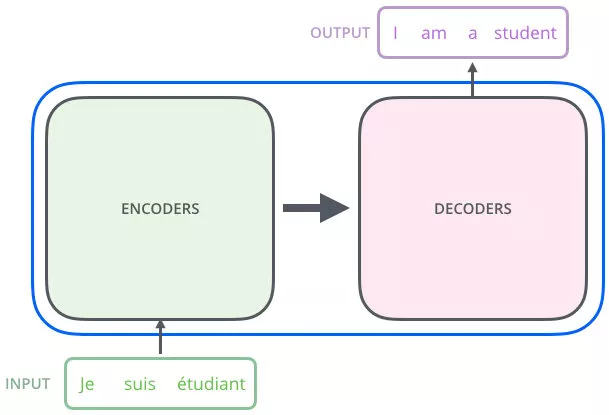

论文中提到了Transformer采用了多个Encoder和多个Decoder进行结合，进一步将上图展开后有，

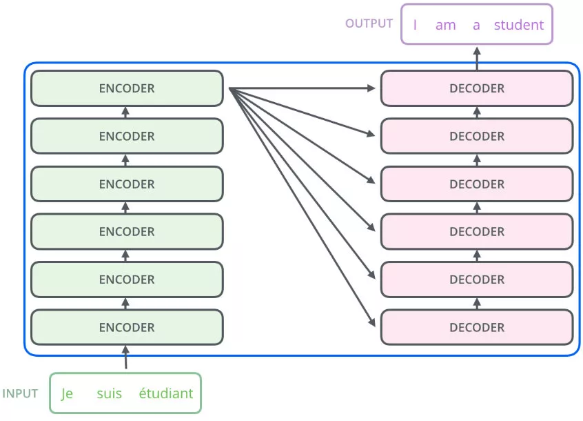

也就是说，Encoder的输出，会和每一层的Decoder进行结合。取其中一层（也即上面第一张模型架构图）进行详细的展示（简化版）如下，

上面提及的结果相当于模型中使用的一个Encoder和一个Decoder，相当于是最上面提到transformer模型架构图的简化形式。在Encoder中，对于输入做Self-Attention，然后前馈输出；在Decoder中，同样对输出进行Self-Attention操作，然后对Encoder中的输出和Self-Attention的结果做一个Attention，最终在前向传播。

该部分对整体框架做了大致介绍，接下来对上面提及的结构进行展开。

### 2.1  Scaled Dot-Product Attention

其结构如下，

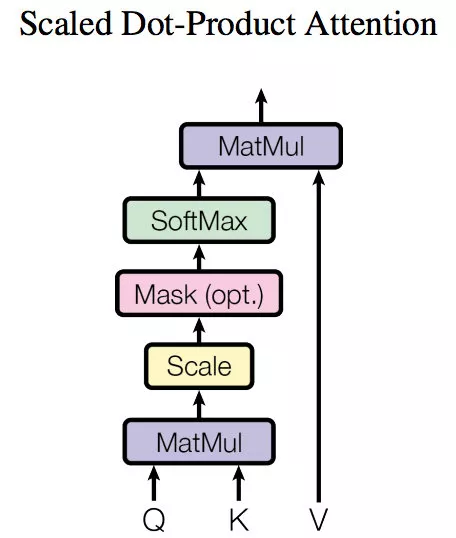

- 第一步生成Q,K,V

  这一步的Q,K,V对应于Attention机制中所提及的Q,K,V。但是这一步之前的输入就只有input的embeeding，如何得到Q,K,V呢？对于给定的输入X，通过三个线性变换将X转换为Q,K,V，

  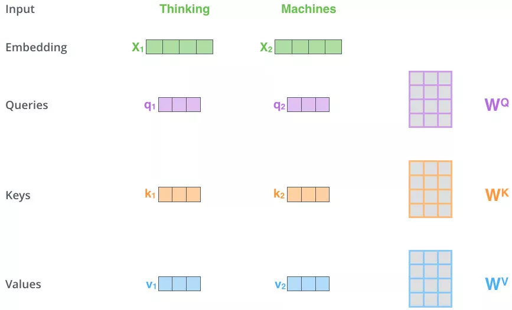

  > 两个单词，Thinking, Machines. 通过嵌入变换会X1,X2两个向量[1 x 4]。分别与Wq,Wk,Wv三个矩阵[4x3]想做点乘得到，{q1,q2},{k1,k2},{v1,v2} 6个向量[1x3]。

- 第二步（Q,K点乘）

  向量{q1,k1}做点乘得到得分(Score) 112, {q1,k2}做点乘得到得分96。

  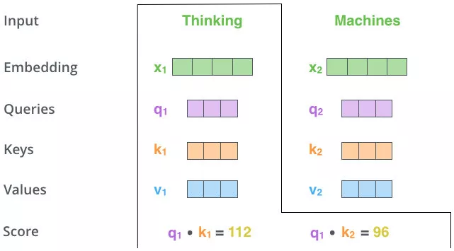

- 第三步和第四步（放缩和softmax）

  对该得分进行规范，除以8。这个在论文中的解释是为了使得梯度更稳定。之后对得分[14，12]做softmax得到比例 [0.88，0.12]。

  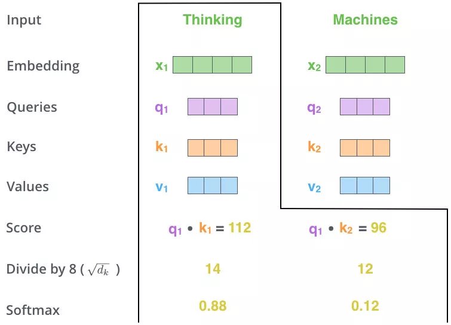

- 第五步（与V做加权）

  在上面得到Q,K的概率分布，与V做加权。

  用得分比例[0.88，0.12] 乘以[v1,v2]值（Values)得到一个加权后的值。将这些值加起来得到z1。这就是这一层的输出。仔细感受一下，用Q,K去计算一个thinking对与thinking, machine的权重，用权重乘以thinking,machine的V得到加权后的thinking,machine的V,最后求和得到针对各单词的输出Z。

  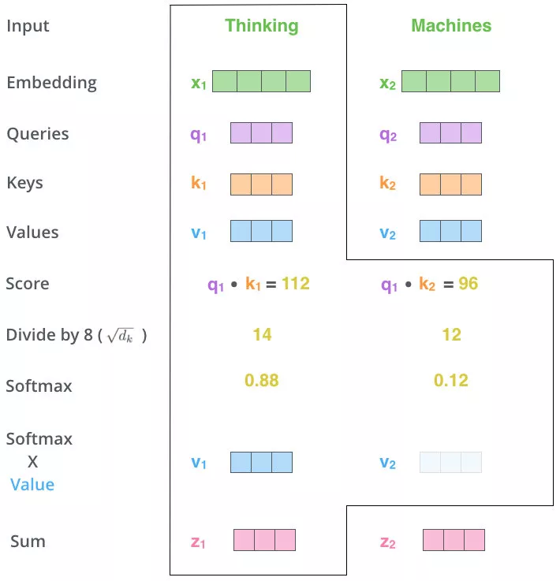

- 整体矩阵表示

  首先根据输入X计算得到Q,K,V。

  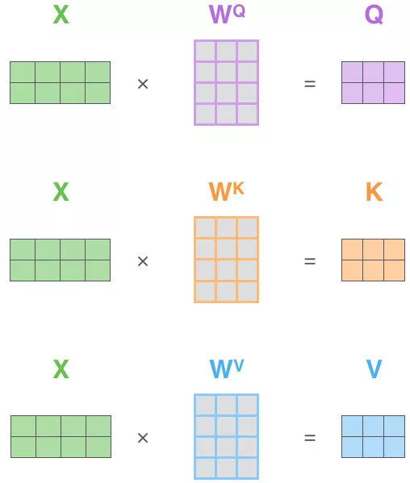

  然后根据Q,K,V计算attention的值。

  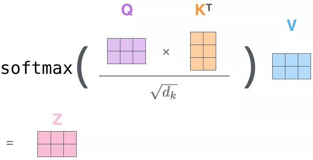

  > Q对K转制做点乘，除以dk的平方根。做一个softmax得到合为1的比例，对V做点乘得到输出Z。那么这个Z就是一个考虑过thinking周围单词(machine)的输出。

  以上这种方式在encoder中被称之为Self-Attention，在decoder中被称之为masked self-attention（不能看到未来的信息），除了这两种attention机制外，还有encoder-decoder attention，即encoder和decoder连接处的attention，这种和传统的encoder-deocoder框架中的attention机制是一致的。

### 2.2 Multi-Head Attention

Multi-Head Attention就是把Scaled Dot-Product Attention的过程做h次，然后把输出Z合起来。论文中，它的结构图如下：

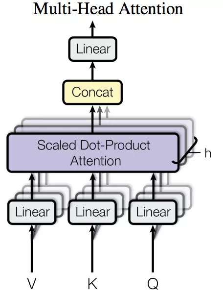

接下来对上面过程做出解释，假设做了8次self-attention，

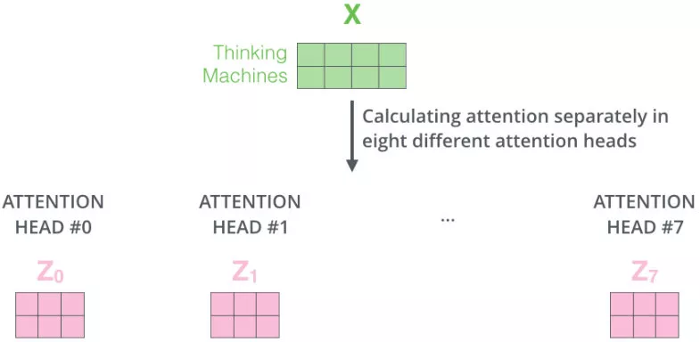

接下来将8个输出拼接起来，为了和一个的输出形状结果类似，将拼接起来的矩阵乘以矩阵进行放缩，如下，

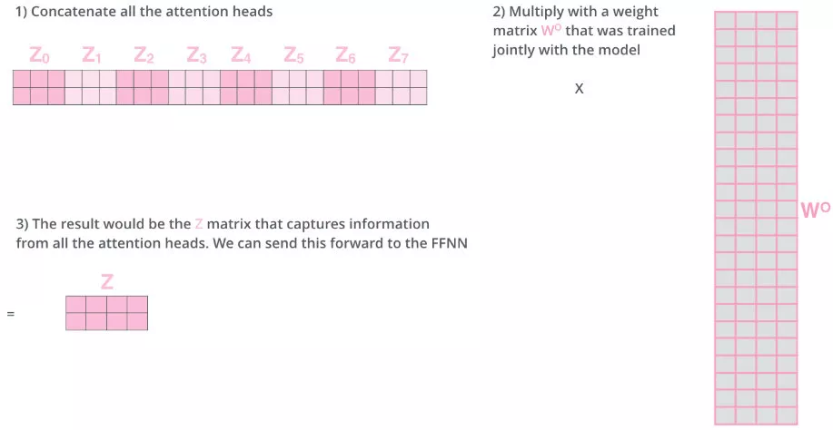

### 2.3 Position Encoding

因为模型不包括Recurrence/Convolution，因此是无法捕捉到序列顺序信息的，例如将K、V按行进行打乱，那么Attention之后的结果是一样的。但是序列信息非常重要，代表着全局的结构，因此必须将序列的分词相对或者绝对position信息利用起来。

这里每个分词的position embedding向量维度也是, 然后将原本的input embedding和position embedding加起来组成最终的embedding作为encoder/decoder的输入。其中position embedding计算公式如下：
$$
\begin{aligned}
PE_{(pos, 2i)} &= sin(pos/10000^{2i/d_{model}}) \\
PE_{(pos, 2i+1)} &= cos(pos/10000^{2i/d_{model}})
\end{aligned}
$$
其中pos表示位置index，i表示dimension index

最终就是将word embedding和position embedding相加作为该输入的embedding，如下，

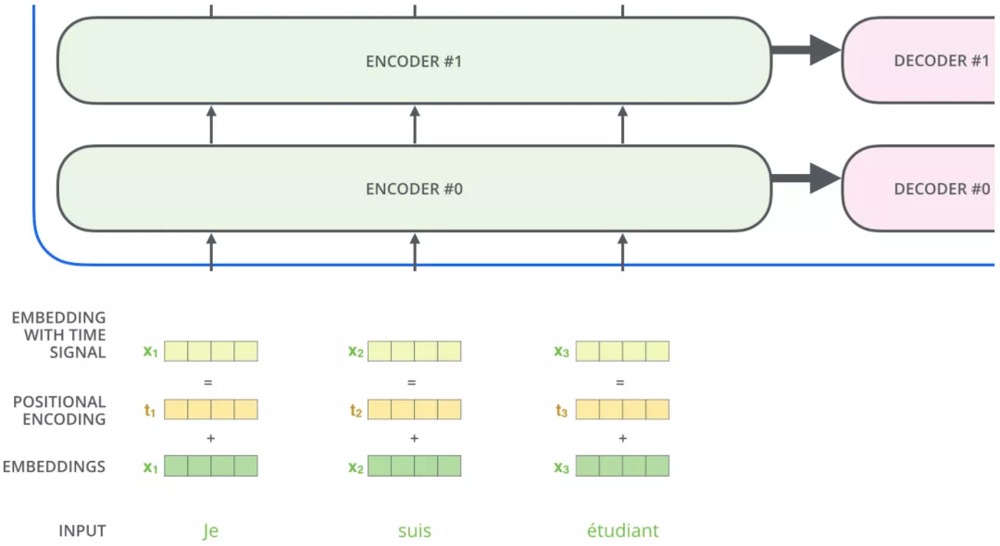

Position Embedding本身是一个绝对位置的信息，但在语言中，相对位置也很重要，Google选择前述的位置向量公式的一个重要原因是，由于我们有：
$$
\begin{aligned}
\sin(\alpha+\beta) &= \sin\alpha \cos\beta + \cos \alpha \sin \beta \\
\cos(\alpha+\beta) &= \cos \alpha \cos \beta - \sin \alpha \sin \beta
\end{aligned}
$$

这表明位置 $k+p$的位置向量可以表示为位置$k$和$p$的特征向量的线性变化，这为模型捕捉单词之间的相对位置关系提供了非常大的便利。

> 在其他NLP论文中，大家也都看过position embedding，通常是一个训练的向量，但是position embedding只是extra features，有该信息会更好，但是没有性能也不会产生极大下降，因为RNN、CNN本身就能够捕捉到位置信息，但是在Transformer模型中，Position Embedding是位置信息的唯一来源，因此是该模型的核心成分，并非是辅助性质的特征。

### 2.4 Position-wise Feed-forward Networks

在进行了Attention操作之后，encoder和decoder中的每一层都包含了一个全连接前向网络，对每个position的向量分别进行相同的操作，包括两个线性变换和一个ReLU激活输出：
$$
FFN(x)=\max(0,xW_1+b_1)W_2+b_2
$$

### 2.5 encoder&decoder&output

接下来，对encoder和decoder的内部结构进行剖析，

#### 2.5.1 encoder结构

论文中，提到有6层encoder，每层encoder包含2个sub-layer

- 第一个sub-layer是multi-head self-attention mechanism，用来计算输入的self-attention
- 第二个sub-layer是简单的全连接网络
- 在每个sub-layer我们都模拟了残差网络，每个sub-layer的输出都是$LayerNorm(x + sublayer(x))$

如下所示，

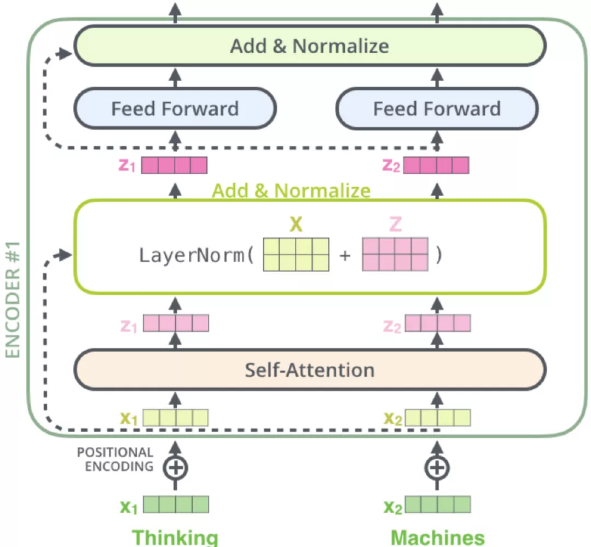

#### 2.5.2 decoder结构

论文中，提到有6层decoder，每层decoder包含3个sub-layer

- 第一个是Masked multi-head self-attention，也是计算输入的self-attention，但是因为是生成过程，因此在时刻 i 的时候，大于 i 的时刻都没有结果，只有小于 i 的时刻有结果，因此需要做Mask

- 第二个sub-layer是全连接网络，与Encoder相同

- 第三个sub-layer是对encoder的输入进行attention计算

  同时Decoder中的self-attention层需要进行修改，因为只能获取到当前时刻之前的输入，因此只对时刻 t 之前的时刻输入进行attention计算，这也称为Mask操作。

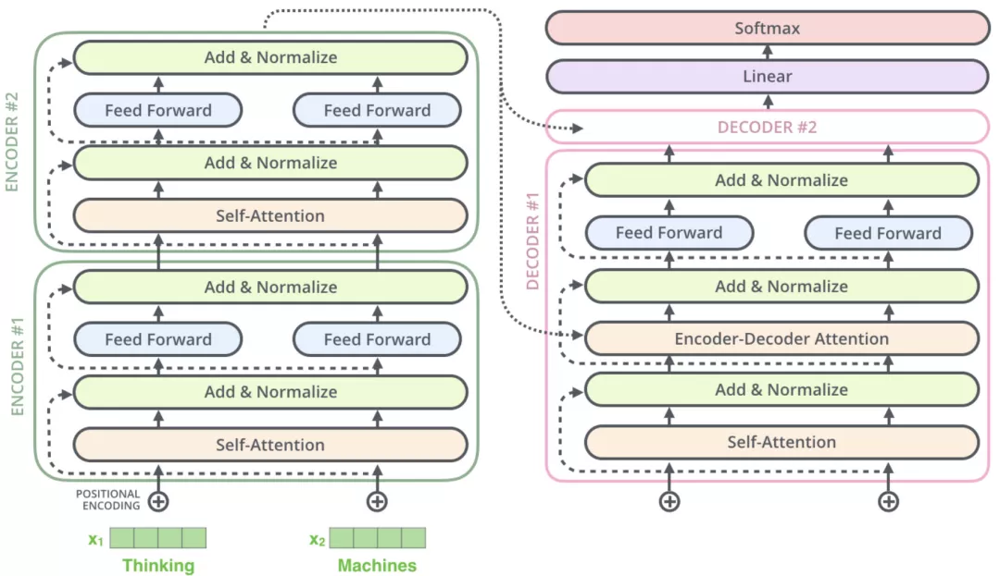

#### 2.5.3 output结构

将Decoder的堆栈输出作为输入，从底部开始，最终进行word预测。

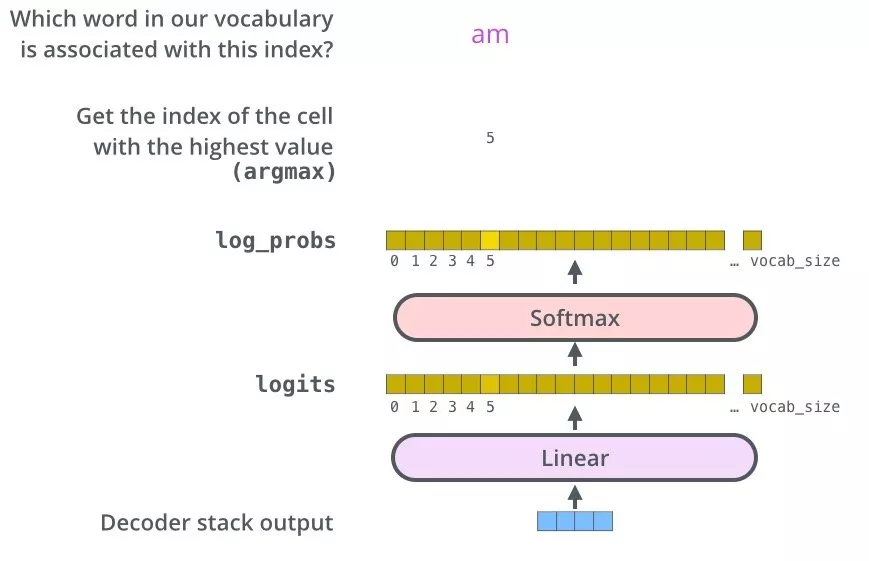

## 3. CODE实现

参考本目录代码文件

## 4. 总结

- 优点
  
  - **算法设计**
  
    其放弃了RNN和CNN这种传统网络，提出用注意力机制来直接学习源语言内部关系和目标，除了算法效果优于之前网络，其可以并行计算，大大加快了计算速度。
  
  - **直接的长距离依赖**
  
    原来的RNN中，第一个词要和第十个词发生关系，必须通过第二~九个词传递，进而产生两者的计算。而在这个过程中，第一帧的信息有可能已经产生了偏差，准确性和速度都难以保证。在Transformer中，由于self-attention的存在，任意两个词都有直接的交互，建立直接依赖。
  
- 缺点
  - Transformer网络具有学习较长期依赖关系的潜力，但是在语言建模的设置中受到**固定长度上下文(fixed-length context)**的限制。
  - Transformer失去的位置信息其实在NLP中非常重要，而论文中在特征向量中加入Position Embedding也只是一个权宜之计，并没有改变Transformer结构上的固有缺陷。
  - 虽然抛弃RNN和CNN虽然非常炫技，但是它也使模型丧失了捕捉局部特征的能力，RNN + CNN + Transformer的结合可能会带来更好的效果。

## 5. Transformer应用

按照时间顺序出现，GPT，BERT，MT-DNN，GPT-2

- GPT（单向二阶段训练模型）

  GPT(Generative Pre-Training)，是OpenAI在2018年提出的模型，利用Transformer模型来解决各种自然语言问题，例如分类、推理、问答、相似度等应用的模型。GPT采用了Pre-training + Fine-tuning的训练模式，使得大量无标记的数据得以利用，大大提高了这些问题的效果。**采用单向的Transfomer模型**。

- BERT（双向二阶段训练模型）

  BERT(Bidirectional Encoder Representation from Transformer)，是Google Brain在2018年提出的基于Transformer的自然语言表示框架。是一提出就大火的明星模型。BERT与GPT一样，采取了Pre-training + Fine-tuning的训练方式，在分类、标注等任务下都获得了更好的效果。**采用双向的Transfoer模型**。

- MT-DNN（多任务模型）

  MT-DNN (Multi-Task Deep Neural Networks) 依然采用了BERT的二阶段训练方法以及双向Transformer。在Pre-Training阶段，MT-DNN与BERT几乎完全一样，但是在Fine-Tuning阶段，MT-DNN采用了多任务的微调方式。**同时**采用Transformer输出的上下文Embedding进行单句分类、文本对相似度、文本对分类以及问答等任务的训练。整个结构如下图所示：

  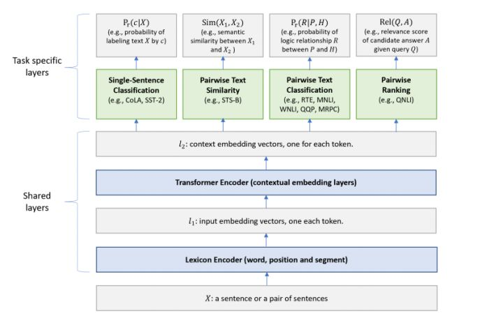

- GPT-2（单向通用模型）

  GPT-2继续沿用了原来在GPT种使用的单向Transformer模型，而这篇文章的目的就是尽可能利用单向Transformer的优势，做一些BERT使用的双向Transformer所做不到的事。那就是通过上文生成下文文本。

  GPT-2的想法就是完全舍弃Fine-Tuning过程，转而使用一个容量更大、无监督训练、更加通用的语言模型来完成各种各样的任务。我们完全不需要去定义这个模型应该做什么任务，因为很多标签所蕴含的信息，就存在于语料当中。就像一个人如果博览群书，自然可以根据看过的内容轻松的做到自动摘要、问答、续写文章这些事。

## References

- [Transfomer](https://luozhouyang.github.io/transformer/)
- [Attention Is All You Need](https://mp.weixin.qq.com/s/RLxWevVWHXgX-UcoxDS70w)
- [seq2seq和Transformer](https://www.cnblogs.com/mengnan/p/9871665.html)

- [详解Transformer （Attention Is All You Need）](https://zhuanlan.zhihu.com/p/48508221)

- [transformer-XL](https://mp.weixin.qq.com/s/2J6sFWavTaq9EisMr6xaMQ)
- [Transformer结构及其应用详解--GPT、BERT、MT-DNN、GPT-2](https://zhuanlan.zhihu.com/p/69290203)

- [nlp中的Attention注意力机制+Transformer详解](https://zhuanlan.zhihu.com/p/53682800)