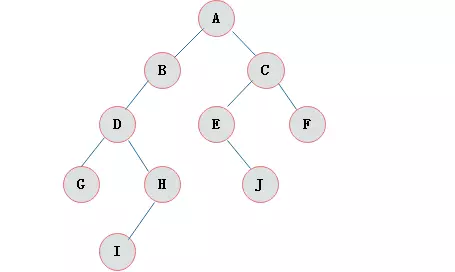
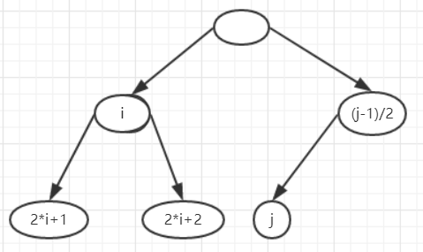
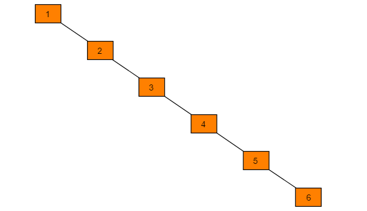
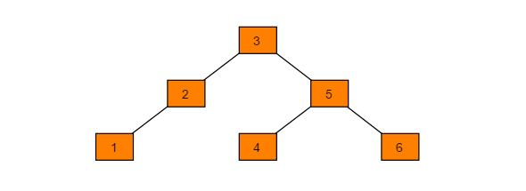

[TOC]
# 数据结构与算法

主要从四个方面来学习**数据结构与算法**，分别为**数据结构**部分、**算法思想**部分、**排序算法**部分和**经典算法题目**部分

## 1. 数据结构

### 1.1 树与二叉树

#### 1.1.1 树的定义以及概念

**树**是n(n>=0)个结点的有限集。n=0时称为空树。

在任意一棵非空树中有，

- 有且仅有一个特定的称为根（root）的结点；
- 当n>1时，其余结点可分为m(m>0)个互不相交的有限集T1、T2、......、Tn，其中每一个集合本身又是一棵树，并且称为根的子树。

> Note: 
>
> 1. n>0时(非空的树)，根结点是唯一的，不可能存在多个根结点，数据结构中的树只能有一个根结点。
>
> 2. m>0时(多个子树)，子树的个数没有限制，但它们一定是互不相交的。

下图是一棵示例的树，

下面是树的一些概念，

- 节点的度

  结点拥有的子树数目称为结点的**度**。在上图中，节点D的度为3，节点J的度为0。

- 结点关系

  - 子结点（孩子结点）

    结点子树的根结点为该结点的孩子结点，上图中B为A的子结点。

  - 父节点（双亲结点）

    类似孩子结点，方向相反，上图中A为B的父节点。

  - 兄弟结点

    父节点相同的两个节点互为兄弟结点，上图中B和C互为兄弟结点。

  - 祖先/子孙结点

    基于上面的父子结点，可以定义传递关系，上图中，A为其余所有结点的祖先结点，反过来其余结点为A的子孙结点。

    > 显然祖先结点包含了父节点

  - 叶子结点

    如果某个结点的子节点均为空（度为0），那么该节点称为叶子结点，上图中，G/H/I/J/F五个结点均为叶子结点

  - 分支结点

    结点度不为0，则该节点为分支结点，可以说除叶子结点外，其余结点均为分支结点

- 路径

  从一个祖先结点到其任何子孙结点都存在一些列边，这样一系列收尾相连的边称为树种的一条**路径**。路径中边的条数称为该路径的**长度**，那么显然有父节点到其子节点的长度为1。上图中，结点B到结点I的路径为（B-D-I）,路径的长度为3。

- 深度/高度/层数

  - 深度

    树中某一结点深度表示从根节点开始至该节点的路径长度，上图中，结点E的深度为3。

  - 高度

    树中某一结点高度表示从该节点出发，至某一个叶节点的最长路径长度，上图中，结点C的高度为2.

  - 层数

    根节点为第一层，往下依次递增。
  
  - 三者关系
  
    树中节点的**最大层数**称之为**树**的**深度**或者**高度**。
  
  > **注意**：从根节点出发计数为0或者1，有不同说法，问题本质相同，提前说明即可，多数算法偏向为后者

#### 1.1.2 二叉树的定义和性质

- 二叉树的定义

  **二叉树**是n(n>=0)个结点的有限集合，该集合或者为空集（称为空二叉树），或者由一个根结点和两棵互不相交的、分别称为根结点的左子树和右子树组成。

  下图为一颗二叉树，

  

  > **二叉树的特点**
  >
  > - 每个结点最多有两棵子树，所以二叉树中不存在度大于2的结点。
  > - 左子树和右子树是有顺序的，次序不能任意颠倒。
  > - 即使树中某结点只有一棵子树，也要区分它是左子树还是右子树。
  > - 二叉树只有五种可能的形态，分别为空二叉树、只有根结点、只有根结点和左子树、只有根结点和右子树和两棵子树均有

- 二叉树的性质

  - 层数对应的结点数量

    在非空的二叉树中，第i层最多有2^(i-1)个结点（i>=1）。

  - 树对应的结点数量

    高度（深度）为h的二叉树至多有2^(h)-1个结点（h>=1）。

  - 叶节点个数和度数为2的结点数量关系

    对于任何非空二叉树，如果其叶节点的个数为n1，度数为2的结点个数为n2，那么n1=n2+1。

#### 1.1.3 二叉树三种形态

二叉树的三种形态分别为**满二叉树**、**扩充二叉树**和**完全二叉树**。

- 满二叉树

  如果二叉树中所有**分支结点**的度数都为2，则它成为一棵满二叉树，显然满二叉树是一般二叉树的一个子集。

- 扩充二叉树

  对于二叉树T，加入足够多的新叶节点，使得T的原有结点都变为度数为2的分支结点，得到的二叉树成为T的**扩充二叉树**，扩充二叉树中，新增的结点称为**外部结点**，原T的结点称为**内部结点**。

- 完全二叉树

  对于一棵高度为h的二叉树，如果第一层至第h层的结点都满（也就是说，对所有的1<=i<=h,第i层有2^(i-1)个结点），如果下一层的结点不满，则所有结点在最左边连续排列，空位都在右边，这样的二叉树称为**完全二叉树**。

  下面为完全二叉树的两个性质：

  - 完全二叉树高度

    n个结点的完全二叉树高度为h=|log2(n)|，即为不大于log2(n)的最大整数

  - 完全二叉树的index

    如果n个结点的完全二叉树，从左至右依次从0编号，那么对任意一个结点i（0<=i<=n-1）

    - 序号为0的结点是根节点
    - 对于i>0，其父节点的编号是(i-1)/2
    - 若2*i+1<n，则其左子节点序号为2\*i+1，否则它无左子节点
    - 若2*i+2<n，则其右子节点序号为2\*i+2，否则它无左子节点

    如下图所示

    

  > 完全二叉树的一些特点，
  >
  > 1）满二叉树一定是完全二叉树，但反过来不一定成立
  >
  > 2）同样结点数目的二叉树，完全二叉树深度最小。
  >
  > 3）如果结点度为1，则该结点只有左孩子，即没有右子树。
  >
  > 4）上面的第二个性质，使其可以方面的存入一个数组中，直接根据下标找到一个结点的子节点和父节点，建立和线性结构的双向映射

#### 1.1.4 二叉树的遍历

二叉树的遍历主要分为两部分，深度优先遍历和宽度优先遍历。

- 深度优先遍历

  深度优先遍历分为三种不同的方式，先根遍历、中根遍历和后根遍历

  - 前根遍历

    即先遍历根节点，然后遍历左子树和右子树，以***1.1.2***中所示的二叉树为例，前根遍历顺序为ABDGHICEJF

  - 中根遍历

    先遍历左子树，然后遍历根节点和右子树，以***1.1.2***中所示的二叉树为例，中根遍历顺序为GDIHBAEJCF

  - 后根遍历

    先遍历左子树和右子树，最后遍历根节点，以***1.1.2***中所示的二叉树为例，后根遍历顺序为GIHDBJEFCA

- 宽度优先遍历

  宽度优先遍历又称之为**层次顺序遍历**，以***1.1.2***中所示的二叉树为例，层次遍历顺序为ABCDEFGHJI

> 深度优先遍历的递归和非递归的code需要熟练掌握，宽度优先遍历的code同样需要熟练掌握

#### 1.1.5 二叉树的应用

- **哈夫曼树**

  - 定义

    给定n个权值作为n个叶子结点，构造一棵二叉树，若带权路径长度达到最小，称这样的二叉树为最优二叉树，也称为哈夫曼树(Huffman tree)。即带权路径长度最短的树）

  - 应用

    基于哈夫曼树对信息进行编码，在数据压缩上有重要应用，提高了传输的有效性。

- **二叉排序树**

  - 定义

    二叉排序树（Binary Sort Tree），又称二叉查找树（Binary Search Tree），亦称二叉搜索树。

    具有以下性质的二叉树：

    1. 若它的左子树不空，则左子树上所有节点的值均小于它的根节点的值；
    2. 若它的右子树不空，则右子树上所有节点的值均大于它的根节点的值；
    3. 它的左右子树也分别为二叉排序树。

  - 操作代价

    既可以有较高的**插入**和**删除**效率，并且具备较高的**查找**效率。
    
    - 查找代价
    
      任何一个数据的查找过程都需要从根结点出发，沿某一个路径朝叶子结点前进。因此查找中数据比较次数与树的形态密切相关。 
      当树中每个结点左右子树高度大致相同时，树高为logN。则平均查找长度与logN成正比，查找的平均时间复杂度在O(logN)数量级上。 
    
      但是当插入的元素有序时，其退化为单支结构，此时查找时间复杂度在O(N)
    
    - 插入代价
    
      新结点插入到树的叶子上，完全不需要改变树中原有结点的组织结构。插入一个结点的代价与查找一个不存在的数据的代价完全相同。
    
    - 删除代价
    
      当删除一个结点P，首先需要定位到这个结点P，这个过程需要一个查找的代价。然后稍微改变一下树的形态。如果被删除结点的左、右子树只有一个存在，则改变形态的代价仅为O(1)。如果被删除结点的左、右子树均存在，只需要将当P的左孩子的右孩子的右孩子的…的右叶子结点与P互换，在改变一些左右子树即可。因此删除操作的时间复杂度最大不会超过O(logN)。
    
    
    **二叉排序树效率总结**，
    
    查找最好时间复杂度O(logN)，最坏时间复杂度O(N)。 
    插入删除操作算法简单，时间复杂度与查找差不多。

- **平衡二叉树**

  二叉排序树一定程度上可以提高搜索效率，但是当原序列有序，例如序列A = {1，2，3，4，5，6}，构造二叉搜索树就是一颗斜树。依据此序列构造的二叉排序树为右斜树，同时二叉树退化成单链表，搜索效率降低为O(n)。

  如下所示，

  

  因此保持树的高度最小，即可保证树的查找效率。如上结构保存为如下图显然提高查询效率，
  
  
  
  - 定义
  
    平衡二叉树（AVL）是一种二叉排序树，其中每个结点的左子树和右子树的高度差至多等于1。*它是**一种高度平衡的二叉排序树***。意思是说，要么它是一棵空树，要么它的左子树和右子树都是平衡二叉树，且左子树和右子树的深度之差的绝对值不超过1。上图所示即为一棵平衡二叉树。
  
    若定义结点的“平衡因子”  BF（Balance Factor） = 左子树深度 –右子树深度 则：平衡二叉树中所有结点的BF ∈[ -1, 0, 1 ]
  
  - 操作代价
  
    - 查找代价
    
      平衡二叉树是严格平衡的二叉排序树（平衡因子不超过1）。那么查找过程与二叉排序树一样，只是平衡二叉树不会出现最差情况的平衡二叉树(单支树)。因此查找效率最好，最坏情况都是O(logN)数量级的。
    
    - 插入代价
    
      AVL必须要保证严格平衡(|bf|<=1)，那么每一次插入数据使得AVL中某些结点的平衡因子超过1就必须进行旋转操作。事实上，AVL的每一次插入结点操作最多只需要修正一次即可。因此，总体上插入操作的代价仍然在O(logN)级别上(插入结点需要首先查找插入的位置)。
    
    - 删除代价
    
      AVL删除结点的算法可以参见二叉排序树的删除结点，但是删除之后必须检查从删除结点开始到根结点路径上的所有结点的平衡因子。因此删除的代价稍微要大一些。每一次删除操作最多需要O(logN)次旋转。因此，删除操作的时间复杂度为O(logN)+O(logN)=O(2logN)。
    
    **二叉平衡树效率总结**，
    
    查找的时间复杂度维持在O(logN)，不会出现最差情况 
    AVL树在执行每个插入操作时最多需要1次旋转，其时间复杂度在O(logN)左右。 
    AVL树在执行删除时代价稍大，执行每个删除操作的时间复杂度需要O(2logN)。

> 该部分主要熟悉二叉树的几种应用，明确几种二叉树的定义以及应用场景，明确各自的效率

#### 1.1.6 二叉树的练习题目

- [另一个树的子树](https://leetcode-cn.com/problems/subtree-of-another-tree)
- [二叉树的最小深度](https://leetcode-cn.com/problems/minimum-depth-of-binary-tree)
- [从前序与中序遍历序列构造二叉树](https://leetcode-cn.com/problems/construct-binary-tree-from-preorder-and-inorder-traversal)
- [二叉树的所有路径](https://leetcode-cn.com/problems/binary-tree-paths) 
- [平衡二叉树](https://leetcode-cn.com/problems/balanced-binary-tree)
- [相同的树](https://leetcode-cn.com/problems/same-tree)
- [递增顺序查找树](https://leetcode-cn.com/problems/increasing-order-search-tree)
- [最大 BST 子树](https://leetcode-cn.com/problems/largest-bst-subtree)
- [叶子相似的树](https://leetcode-cn.com/problems/leaf-similar-trees)
- [对称二叉树](https://leetcode-cn.com/problems/symmetric-tree)
- [翻转二叉树](https://leetcode-cn.com/problems/invert-binary-tree)
- [合并二叉树](https://leetcode-cn.com/problems/merge-two-binary-trees)
- [二叉树的坡度](https://leetcode-cn.com/problems/binary-tree-tilt)
- [单值二叉树](https://leetcode-cn.com/problems/univalued-binary-tree)

### 1.2 链表

### 1.3 栈

### 1.4 字典

## 2. 算法思想

### 2.1 动态规划

#### 2.1.1 定义

#### 2.1.2 练习题目

- [最大子序和](https://leetcode-cn.com/problems/maximum-subarray)
- [爬楼梯](https://leetcode-cn.com/problems/climbing-stairs)

### 2.2 贪心算法

## 3. 排序算法

### 3.1 快速排序

### 3.2 归并排序

## 4. 经典算法题目

### 4.1 TOP N问题

### 4.2 找到k大的数字

## 5. References

- [二叉树基础](https://www.jianshu.com/p/bf73c8d50dc2)

- [Leetcode——二叉树常考算法整理](https://blog.csdn.net/qq_32690999/article/details/80484440)

- [数据结构与算法——平衡二叉树](https://xiaozhuanlan.com/topic/2937850641)

- [二叉查找树、平衡二叉树、红黑树、B-/B+树性能对比](https://blog.csdn.net/z702143700/article/details/49079107)