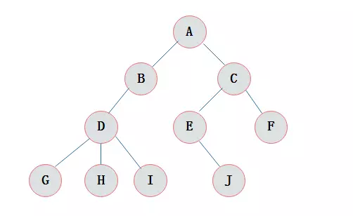

[TOC]
# 数据结构与算法

主要从四个方面来学习**数据结构与算法**，分别为**数据结构**部分、**算法思想**部分、**排序算法**部分和**经典算法题目**部分

## 1. 数据结构

### 1.1 树与二叉树

#### 1.1.1 树的定义以及概念

**树（Tree）**是n(n>=0)个结点的有限集。n=0时称为空树。

在任意一颗非空树中有，

- 有且仅有一个特定的称为根（root）的结点；
- 当n>1时，其余结点可分为m(m>0)个互不相交的有限集T1、T2、......、Tn，其中每一个集合本身又是一棵树，并且称为根的子树。

> Note: 
>
> 1. n>0时(非空的树)，根结点是唯一的，不可能存在多个根结点，数据结构中的树只能有一个根结点。
>
> 2. m>0时(多个子树)，子树的个数没有限制，但它们一定是互不相交的。

下图是一颗示例的树，

下面是树的一些概念，

- 节点的度

  结点拥有的子树数目称为结点的**度**。在上图中，节点D的度为3，节点J的度为0。

- 结点关系

  - 子结点（孩子结点）

    结点子树的根结点为该结点的孩子结点，上图中B为A的子结点。

  - 父节点（双亲结点）

    类似孩子结点，方向相反，上图中A为B的父节点。

  - 兄弟结点

    父节点相同的两个节点互为兄弟结点，上图中B和C互为兄弟结点。

  - 祖先/子孙结点

    基于上面的父子结点，可以定义传递关系，上图中，A为其余所有结点的祖先结点，反过来其余结点为A的子孙结点。

    > 显然祖先结点包含了父节点

  - 叶子结点

    如果某个结点的子节点均为空（度为0），那么该节点称为叶子结点，上图中，G/H/I/J/F五个结点均为叶子结点

  - 分支结点

    结点度不为0，则该节点为分支结点，可以说除叶子结点外，其余结点均为分支结点

- 路径

  从一个祖先结点到其任何子孙结点都存在一些列边，这样一系列收尾相连的边称为树种的一条**路径**。路径中边的条数称为该路径的**长度**，那么显然有父节点到其子节点的长度为1。上图中，结点B到结点I的路径为（B-D-I）,路径的长度为3。

- 深度/高度/层数

  - 深度

    树中某一结点深度表示从根节点开始至该节点的路径长度，上图中，结点E的深度为3。

  - 高度

    树中某一结点高度表示从该节点出发，至某一个叶节点的最长路径长度，上图中，结点C的高度为2.

  - 层数

    根节点为第一层，往下依次递增。
  
  - 三者关系
  
    树中节点的**最大层数**称之为**树**的**深度**或者**高度**。
  
  > **注意**：从根节点出发计数为0或者1，有不同说法，问题本质相同，提前说明即可，多数算法偏向为后者

#### 1.1.2 二叉树的定义和性质

- 二叉树的定义

  **二叉树**是n(n>=0)个结点的有限集合，该集合或者为空集（称为空二叉树），或者由一个根结点和两棵互不相交的、分别称为根结点的左子树和右子树组成。

  下图为一颗二叉树，

  

  > **二叉树的特点**
  >
  > - 每个结点最多有两颗子树，所以二叉树中不存在度大于2的结点。
  > - 左子树和右子树是有顺序的，次序不能任意颠倒。
  > - 即使树中某结点只有一棵子树，也要区分它是左子树还是右子树。
  > - 二叉树只有五种可能的形态，分别为空二叉树、只有根结点、只有根结点和左子树、只有根结点和右子树和两颗子树均有

- 二叉树的性质

  - 层数对应的结点数量

    在非空的二叉树中，第i层最多有2^(i-1)个结点（i>=1）。

  - 树对应的结点数量

    高度（深度）为h的二叉树至多有2^(h)-1个结点（h>=1）。

  - 叶节点个数和度数为2的结点数量关系

    对于任何非空二叉树，如果其叶节点的个数为n1，度数为2的结点个数为n2，那么n1=n2+1。

#### 1.1.3 二叉树三种形态

### 1.2 链表

### 1.3 栈

### 1.4 字典

## 2. 算法思想

### 2.1 动态规划

### 2.2 贪心算法

## 3. 排序算法

### 3.1 快速排序

### 3.2 归并排序

## 4. 经典算法题目

### 4.1 TOP N问题

### 4.2 找到k大的数字

## 5. References

- [二叉树基础](https://www.jianshu.com/p/bf73c8d50dc2)

